# Mail Templates

Mail Templates (not to be confused with Templates) is an Outlook add-in that allows you to use predefined email templates stored in SharePoint while composing emails in Outlook Desktop Client or Outlook Web App (OWA). The application facilitates pre-populating these templates with client or job data and attachments before sending the email.

The following sections detail how to use Mail Templates:

- [Mail Templates](#mail-templates)
  - [Getting Started](#getting-started)
  - [The Controls](#the-controls)
    - [Update Theme](#update-theme)
    - [Refresh Clients and Folders](#refresh-clients-and-folders)
    - [Connect to Document Center](#connect-to-document-center)
    - [Help](#help)
  - [Creating Email Templates](#creating-email-templates)
    - [Create new email template from Outlook](#create-new-email-template-from-outlook)
    - [Creating new email templates from Outlook Web](#creating-new-email-templates-from-outlook-web)
  - [Creating Emails](#creating-emails)
  - [Merging and Editing](#merging-and-editing)
  - [Adding Attachments](#adding-attachments)

## Getting Started

Mail Templates is accessed from Outlook Desktop client or Outlook Web App (OWA) from your browser by clicking the “New Email” button and then selecting Add-Ins > OnePractice Mail for OWA or Message Tab > Apps For Office > OnePractice Mail for Outlook Desktop.

On first run you will be presented with the Connect to Document Center fly-out window. Enter your SharePoint Document Center URL which will be in a format similar to https://<designator>.sharepoint.com/documentcenter and your Office 365 login details. 

Now click the Connect button to connect to SharePoint. This will run a one-off Mail Templates synchronization process to retrieve your SharePoint templates including your clients' list. Once the software has run its initial synchronization each subsequent access should be faster as the software caches your list information on your own PC. 

> **Please note:** For this reason when you add new clients to your clients' list or if you add new folders or subfolders to SharePoint you will need to resynch the software.

## The Controls

There are four controls available at the top of the application. These are:

### Update Theme

Synchronizes the application theme with your Office 365 theme.

### Refresh Clients and Folders

Synchronize the application with any changes to your clients' list or templates in your Modern Practice Templates folder.

### Connect to Document Center

Go here to enter your Office 365 credentials and your SharePoint Document Center site address.

### Help

Navigate to the software help website

## Creating Email Templates

Email templates are stored in the same SharePoint Document Library as are templates used in the Templates application. To navigate to this library login to your SharePoint Document Center, click the Settings Cog > Site Contents > Modern Practice Templates. 

In this folder, any .msg file you save will be presented by Mail Templates as a candidate to be used in the composition of a new email. 

There are two ways to create email templates:

- Create new email template directly from Outlook
- Using Mail Templates to create templates

### Create new email template from Outlook

1. Select **New Email** and create your template email content including adding any attachments you want to be included in the template.
    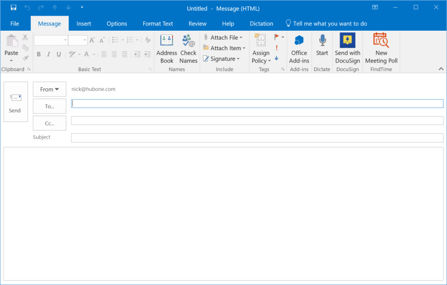
2. Be sure to correctly apply the Template Field format rules as laid out later in the document. 
    > Note: You can use the Template Field Builder to correctly create template fields. This is located in the Templates software within your SharePoint Document Center.
3. Click the File Tab and select Save As… 
    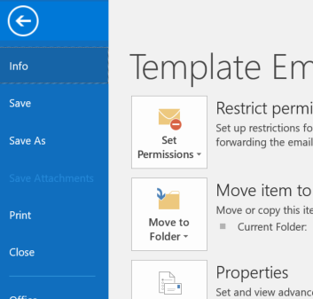
4. Select the default save option and save to your local machine (Outlook Message Format – Unicode).
    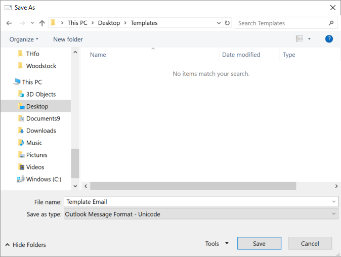
5. Drag and drop the file into the Modern Practice Templates folder in your Document Center.
    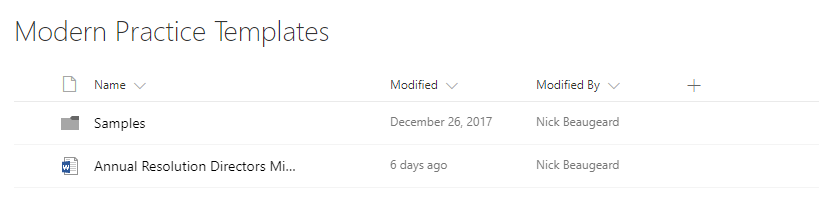
6. The file will now be available in the Template Explorer panel once you have refreshed its contents.
    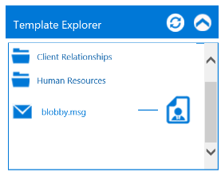

### Creating new email templates from Outlook Web

1. Select **New Email** in Outlook and create your template email content including adding any attachments you want to be included in the template.
2. Be sure to correctly apply the Template Field format rules. 
    > **Note**: You can use the Template Field Builder to correctly create template fields. This is located in the Templates software within your SharePoint Document Center.
3. Allow Outlook to save the email as a draft to your Drafts folder. You can do this simply by closing the email window – Outlook will notify you that the item has been saved to your Drafts Folder.
4. To save as a draft in OWA, click the ellipsis (…) in the top menu ribbon and select Save draft.

5. Click the Load Drafts button on the Email Template Manager software to load up all your Draft Emails.
    
    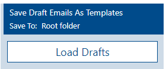

6. Select the draft you wish to save as a template and rename it if you like.
    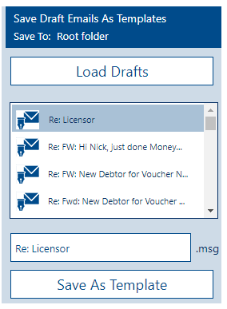

7. Click **Save as Template** to save it to SharePoint.

## Creating Emails

1. Once you have selected the email template you wish to use, click the Merge with Client Icon next to the template name.
    
    

2. Select the client you wish to email using the search bar. Start by typing 3 characters and a list will populate with all clients that contain those characters, allowing you to search on any part of the name. Their data will then be used to populate the email template.
    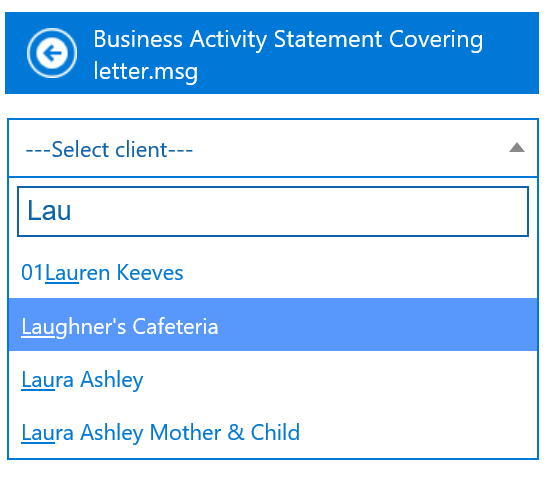

3. The primary contact email address of that client will be displayed and automatically used as the default email address of the email.

4. You can add extra recipients to the email in the Outlook Recipients boxes.
    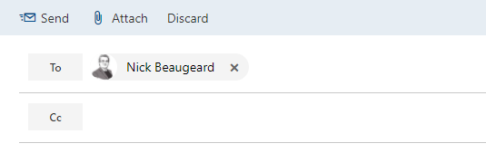

5. If you do not wish to edit the email body or add additional attachments, you can now click the Send Email button.

    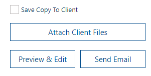

## Merging and Editing

1. Once you have selected the email template, click the Preview & Edit button.
    
2. This will allow you to manually edit the email before sending it directly from Outlook.

> **Note**: Once you click the Preview & Edit button, please be patient as the software can take up to 15 seconds to process the request.

## Adding Attachments

Once you have selected a client from the list, you can add attachments to your email from within that client's Document Center folder before you send. 

1. Click the Attach Client Files button.
    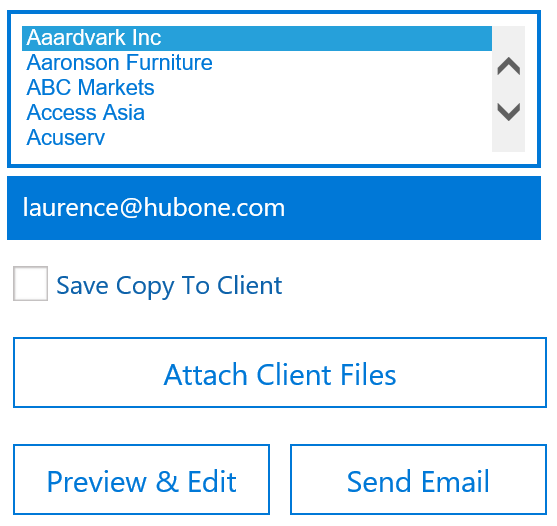
   1. This will return the most recent 50 documents in that client’s folder in SharePoint.
   2. If you wish to retrieve a document that isn't listed, you can enter in a search term and click the Search icon. This will search all the documents under this client and return the relevant matches.
        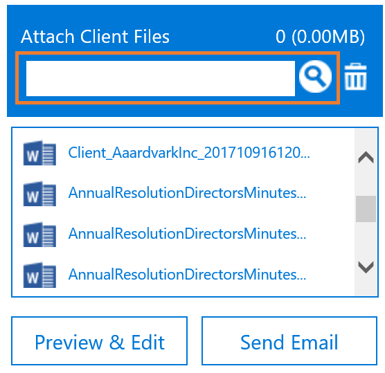
2. Select the files you wish to attach by clicking the file name/s. 
   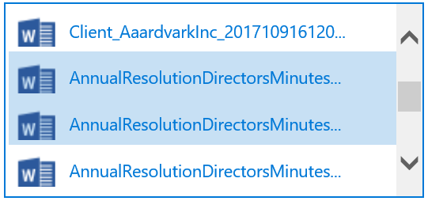
3. The size of the combined attachments will be displayed as you pick and choose.
    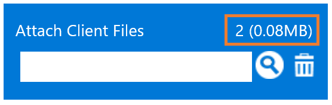
4. To deselect just re-click the document.

5. You can then preview the email and the files will appear as attachments.
     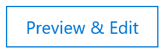
6. You may be prompted to enter additional information. This may occur if the template includes custom field tags. 
    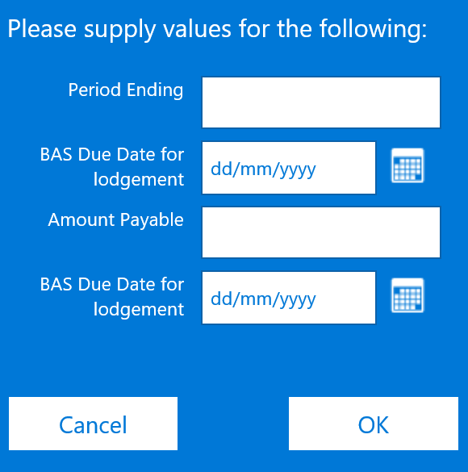
7. The email preview will then open in a new message window. If you are happy with the email, click Send.
    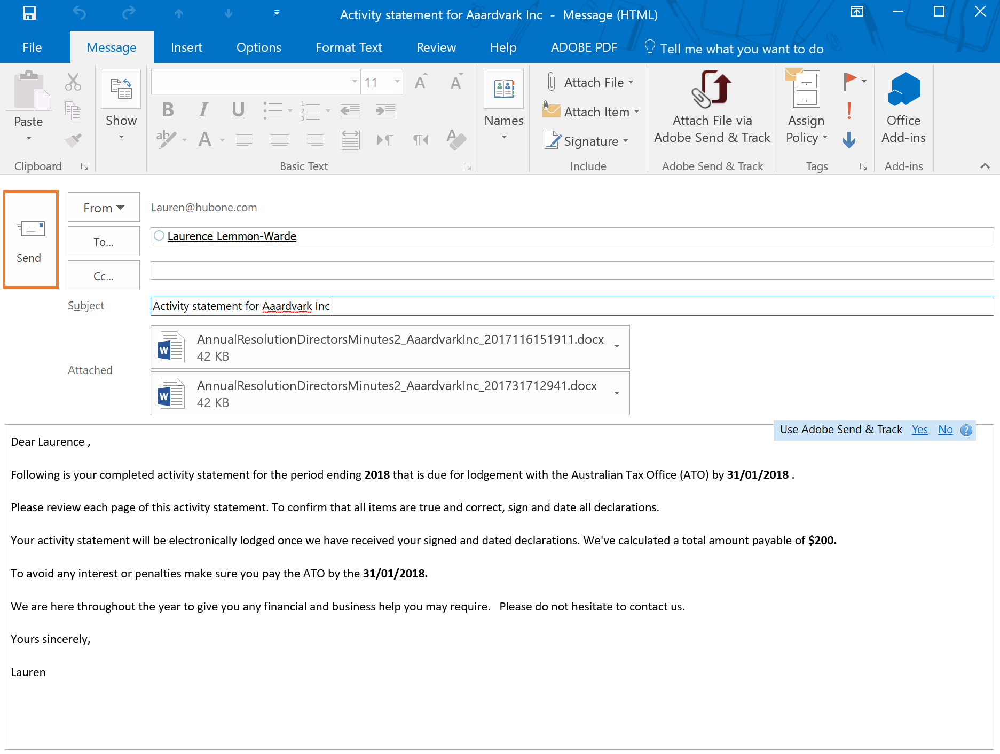

