# Mail

Management of email messages has consistently been a difficult task. Ensuring emails and attachments to and from clients are saved and filed appropriately has commonly been the Achilles heel of many document management platforms.

HubOne solves this with Mail, a certified add-in to Microsoft Outlook which enables the rapid configuration, catalog and filing of emails directly to your document center. It also allows the user to assign metadata to the email before it is filed, and file in the root or subfolders beneath a client’s directory in SharePoint.

The following sections detail how to use Mail.

- [Mail](#mail)
  - [Getting Started](#getting-started)
  - [The Controls](#the-controls)
    - [Update theme](#update-theme)
    - [Refresh Clients and folders](#refresh-clients-and-folders)
    - [Connect to Document Center](#connect-to-document-center)
    - [Settings](#settings)
    - [Help](#help)
  - [Using Mail](#using-mail)
    - [Outlook Desktop](#outlook-desktop)
    - [Outlook Web App](#outlook-web-app)
    - [Mail Main Screen](#mail-main-screen)
  - [Saving Emails to Client Folders](#saving-emails-to-client-folders)
    - [Basic Saving](#basic-saving)
  - [Saving to Subfolders](#saving-to-subfolders)
  - [Saving Attachments](#saving-attachments)
    - [Save Attachments Only](#save-attachments-only)
    - [Saving Selected Attachments](#saving-selected-attachments)
  - [Renaming Attachments](#renaming-attachments)
  - [Add Sender as a contact](#add-sender-as-a-contact)
  - [Renaming an email file](#renaming-an-email-file)
  - [Categorising emails in Outlook](#categorising-emails-in-outlook)

## Getting Started
On first run, you will be presented with the **Connect to Document Center** popup window

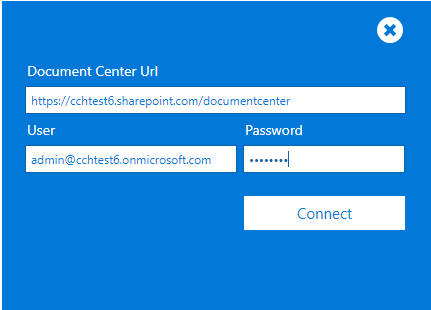

Enter your SharePoint Document Center URL which will be in a format like ```https://<designator>.sharepoint.com/documentcenter``` and enter your Office 365 login details.

Once done, click the **Connect** button to connect to SharePoint. This will run a one-off synchronisation process to retrieve your clients' list.

Once the software has run its initial synchronisation each subsequent access should be faster as the software caches your list information on your own PC. 

> **Please note:** For this reason, when you add new clients to your clients' list or if you add new folders or subfolders to SharePoint you will need to click the refresh button.

## The Controls
There are five controls available at the top of the application.

They are:

| Icon | Description |
| -- | -- |
|  | Update theme |
|  | Refresh Clients & Folders |
|  | Connect to Document Center |
|  | Settings |
| | Help |

### Update theme
This button ensures the colors of Mail matches your Office 365 theme.

### Refresh Clients and folders
Synchronize the application with any changes to your clients' list or your folder structure in SharePoint.

### Connect to Document Center
Go here to enter your Office 365 credentials and your SharePoint Document Center site address.

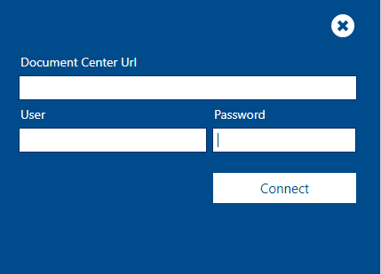

### Settings
View your settings for OnePractice

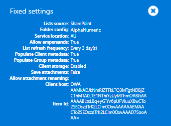

### Help

Navigate to the software help website where you can download the complete Mail documentation.

## Using Mail

Mail is accessed from your email body in Outlook Desktop client or Outlook Web App (OWA) from your browser by clicking the Mail tab at the top of the email read window.

### Outlook Desktop

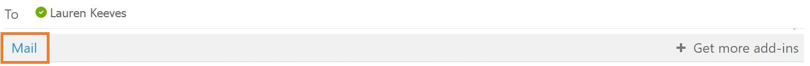

### Outlook Web App

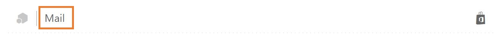

### Mail Main Screen

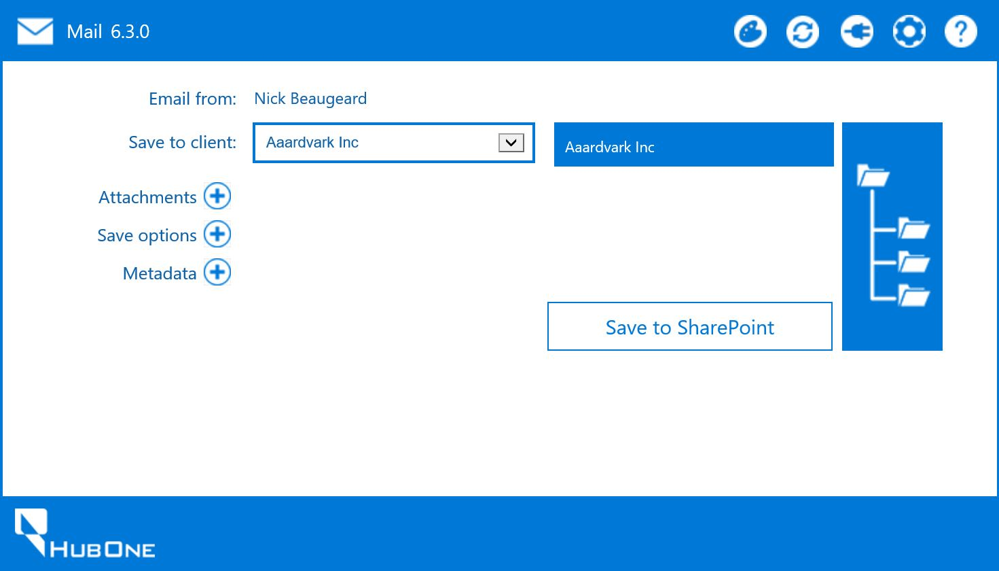

- **Email from:** This shows the email sender.
- **Save to client:** The client folder you wish to save the email to. The client name is automatically populated if the email address matches the primary contact in your practice management software. 
    If Mail has not been able to match the client, which could be if the contact isn't within your practice management software, you can select the dropdown and search for the correct client. Start by typing 3 characters and a list will populate with all clients that contain those characters, allowing you to search on any part of the name.
    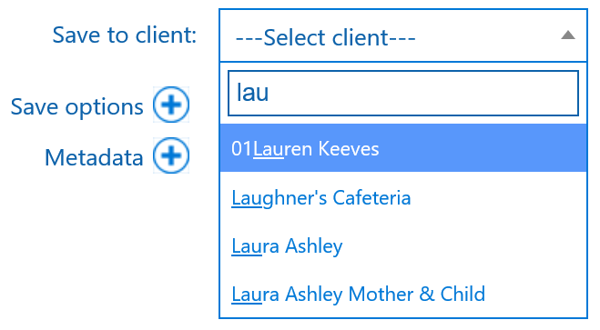
- **Target folder** (Next to Save to client): This indicates the location in SharePoint where the email will be saved. By default, it will be the selected client folder. If you select a subfolder, this will change accordingly.
- **Subfolders**: The subfolders button allows you to view folders within the chosen client folder for selection.
- **Attachments**: Options for saving attachments and renaming.
- **Save options**: Click to expose various extra save options, such as renaming the email.
- **Metadata**: Click to expose any metadata columns you may have added to your Documents Library in the SharePoint Document Center.

## Saving Emails to Client Folders

### Basic Saving
At its most basic, the application is used to save emails to client folders in SharePoint. Select the desired client target from the dropdown list and click **Save to SharePoint**. This will queue the email for saving and will then save directly to the root folder of the client selected in .msg file format. 

To allow you to continue working immediately, the software will place the email in a queue for saving. The following message indicates this. You can now continue working. 


> **Important note:** You must not delete your email immediately after saving. The queue will need to locate it in the folder you saved it from to save it to SharePoint – this can take a few seconds after you save the email. Please wait until the blue OnePractice category icon appears before deleting. It is also advised that you do not have an Outlook rule that auto-deletes your emails.

Once the email has been saved, the cloud icon will display a tick inside (as shown below). A link, **Open last save location**, will also appear, whereby you can you view the email within the Document Center. Should you return to this email in your inbox at a later date, even on reloading Outlook of the app, the **Open last save location** link will always appear so that you can quickly access it within the Document Center.

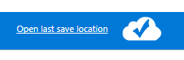

**Please note**, if you are using Internet Explorer and are not able to open the Save Location. 

1. Go to **Internet Options** in your browser.
2. Click the **Security** Tab.
3. Select **Trusted Sites** and then click the Sites button.
4. Add ``https://outlook.office.com``` to your trusted sites as in the image below.
    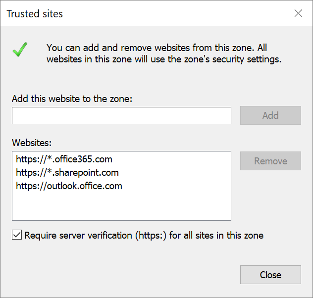

## Saving to Subfolders


If the chosen client target has subfolders under its root directory, by clicking on the subfolder icon (as shown below), the list of available folders will appear in its place.

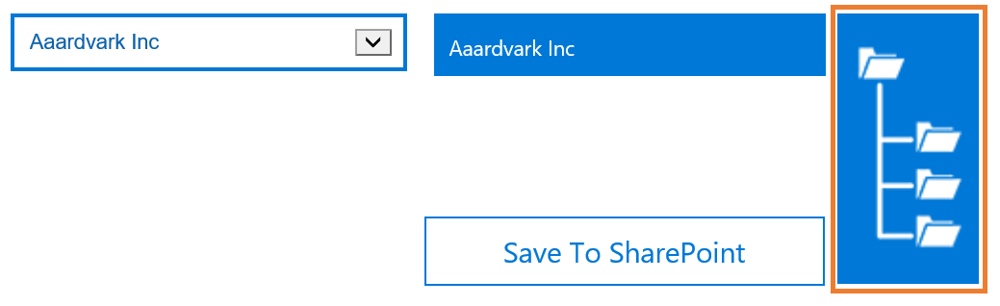

From here, you can choose to save to a subfolder by selecting a folder from the list.

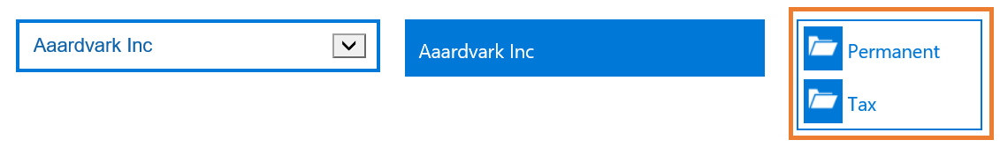

The selected folder will appear in the **Target Folder** box. 

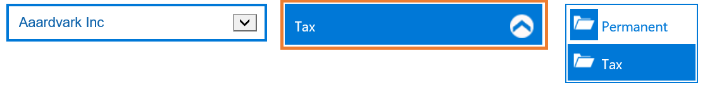

To navigate back up to the top, click the up-arrow icon as shown below.

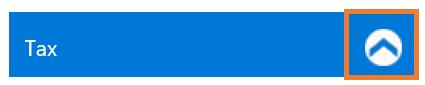

## Saving Attachments

If your email has attachments and you wish to save them separately to the client folder as well, open the **Attachments** panel and select the Save attachments checkbox. All non-embedded attachments (*an embedded attachment is e.g. your company logo embedded in the email body*) will be saved to your target folder as individual files. If you don’t save the attachments individually, the saved email item (.msg) will still contain the files if you open the email in Outlook. 

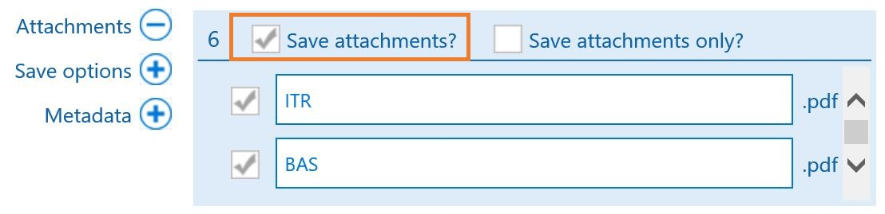

### Save Attachments Only

After you've opened the Attachments panel and selected Save attachments, you must then select the **Save attachments only**? checkbox. 

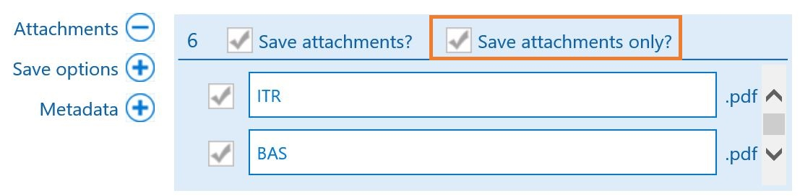

### Saving Selected Attachments

If you don't want to save all attachments, you can simply untick the checkbox next to the attachment/s you do not wish to save.

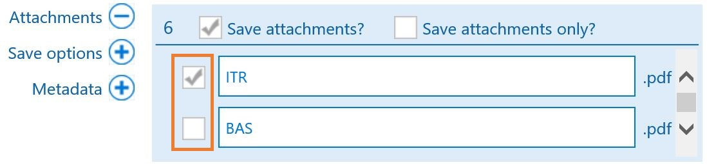

> ***Why would I save attachments as separate files outside the email?***
There are many reasons, one could be that you wish to forward a particular file separately and create a new email through the Mail Templates software or if you wish to edit the attached file.

## Renaming Attachments
Sometimes a client may send you attachments with obscure naming. This may be something that they recognise or was generated by their scanner. In these cases, you may wish to rename the attachments before saving to the document center to avoid losing the document due to it's unfamiliar naming. 

1. Open the Attachments panel and click Save attachments. 
2. Each attachment will be listed below with their current name inside the text box. 
3. You can simply delete and enter your own naming. 
4.  Deselect the check box next to an attachment you don't wish to save.

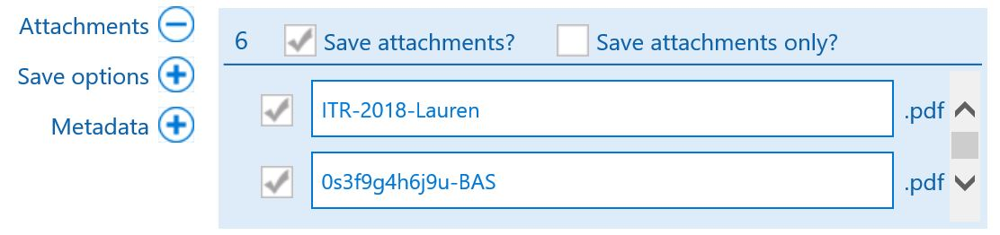

## Add Sender as a contact
*This features is currently deprecated and does not function*

## Renaming an email file

If you wish to change the name of the email being saved to your client’s folder, open the Save options section and enter a new name in the Rename File textbox. If this is blank, the email will be saved using the subject line as name.

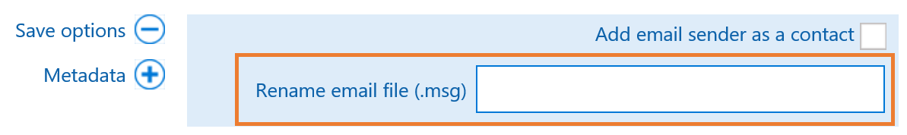

## Categorising emails in Outlook


