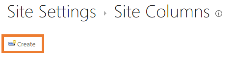

# Metadata

In this document
- [Metadata](#metadata)
  - [What is Metadata?](#what-is-metadata)
  - [Why use Metadata?](#why-use-metadata)
  - [Automatic Metadata Columns](#automatic-metadata-columns)
  - [Creating your own Metadata](#creating-your-own-metadata)
    - [Adding a column to the site root](#adding-a-column-to-the-site-root)
    - [Adding a Column to the Documents Library](#adding-a-column-to-the-documents-library)
    - [Setting default metadata](#setting-default-metadata)
  - [Making Columns Searchable](#making-columns-searchable)
  - [Metadata and OnePractice](#metadata-and-onepractice)
  - [Important notes and recommendations](#important-notes-and-recommendations)

## What is Metadata?

Metadata is simply extra data used to describe your document. When we talk about metadata in the context of OnePractice, we are talking about adding extra fields/columns to SharePoint to store more data against a document when it is saved.

## Why use Metadata?

The extra data columns help us move away from traditional folder hierarchy structures and allow us to search for our documents based on sophisticated configured properties. The columns are not included in a SharePoint by default so we will have to create them ourselves.

Examples of metadata columns you may want to attribute to a document could include Tax Year, Document Type (such as Correspondence, Admin, ASIC, Tax) and more.

Things to consider:

- Metadata is useful in describing documents and could be used for categorizing and grouping documents foregoing the need for a complicated folder structure in your Client folder in SharePoint.
- These columns will only become searchable after your site is re-indexed (this happens automatically every hour or so).
- When implemented, the metadata columns will appear in all OnePractice apps (Templates, Mail and Scans).

Note: Mandatory fields are not supported by OnePractice. [Learn more]

## Automatic Metadata Columns

OnePractice allows the toggling of two settings in the HubOne Common AppSettings list in your SharePoint Document Center to automatically save Client and Client Group metadata columns against all saved documents.

- ```PopulateClientMetadataField``` – set to “True” will populate a metadata column called Client with the relevant client name against all items saved using OnePractice.
- ```PopulateGroupMetadataField``` – set to “True” will populate a metadata column called ClientGroup with the relevant client’s groups against all items saved from OnePractice.

## Creating your own Metadata

To create searchable metadata columns for your documents in SharePoint you will need to add a column to the site root and to the Documents library – to do this you will perform the following simple tasks:

  - [Adding a column to the site root](#adding-a-column-to-the-site-root)
  - [Adding a Column to the Documents Library](#adding-a-column-to-the-documents-library)

### Adding a column to the site root

1. Navigate to the root of your Document center https://<designator>.sharepoint.com/documentcenter or similar.
2. Click on the Settings Cog and open Site settings.
   
   

3. Select Site columns
   
4. Select **Create**.
   
   

5. Enter a column name and then select the type of metadata column you wish to append to your documents. OnePractice supports:
   1. Text
   2. Multiple Lines of Text
   3. Choice
   4. Number
   5. Date
   6. Yes/No column types. 
   
    Examples of custom columns could include Tax Year, Priority, Filed at ATO or similar. 
6. Select **OnePractice Columns** as your group for easy location later. If this group doesn't exist, add it.
7. If you selected **Choice** you will need to enter the list of options.
   
   

8. You should also configure a default value for this column
   
   

9. Finally, click **Ok** at the bottom of the page.

### Adding a Column to the Documents Library

1. Navigate to your Document Library https://<designator>.sharepoint.com/documentcenter/Documents or similar.
2. *Non-Classic SharePoint Experience:* Select the cog icon and **Library settings**.
   
   

    *Classic SharePoint Experience:* Select the Library Tab and then click **Library settings**.

    

3. Scroll down to **Columns**
4. Select **Add from existing site columns.**
   

5. Select **OnePractice Columns** from the **select site columns** from the dropdown menu.
6. Select your new column from the **Available site columns** list.
7. Click **Add** and it will move to the **Columns to add** list
   

### Setting default metadata

1. Navigate to your Document Library https://<designator>.sharepoint.com/documentcenter/Documents or similar.
2. *Non-Classic SharePoint Experience:* Select the cog icon and **Library settings**.
   
   

    *Classic SharePoint Experience:* Select the Library Tab and then click **Library settings**.

    
3. Scroll down to **Columns**
4. Select the column you wish to update the default option. A page will open where you can update the column settings.
   
5. Scroll down to **Default Value**

    
6. Enter the default option
7. Click **Ok** at the bottom of the page

## Making Columns Searchable

To enable search on your new columns, they will have to be indexed.
1. Navigate to your Document Library https://<designator>.sharepoint.com/documentcenter/Documents or similar.
2. *Non-Classic SharePoint Experience:* Select the cog icon and **Library settings**.
   
   

    *Classic SharePoint Experience:* Select the Library Tab and then click **Library settings**.

    
3. Scroll down to **Columns** and select **Indexed Columns**
4. Select **Create a new index** and add your new column
   

If your column doesn’t appear it is most likely because you added it to the site root and not directly to the Documents library. To add it to the Document Library select **Add from existing site columns**, choose the column from the **Available Site Columns** list and click OK. You will now be able to add the column as an index.

As your SharePoint site is only re-indexed every 30 minutes or so, the column may not be immediately searchable. You can force a re-index by accessing:

**Site Settings > Search and Offline Availability >Re-Index Site**

Please note, you may need to still wait a while before the column is indexed.

## Metadata and OnePractice


These custom metadata columns will now appear in Templates, Mail, Mail Templates and Scans after you hit the refresh buttons in each. 

Enter your custom metadata and this data will be filed against your document. Once your site has been indexed, this data will be searchable. 

## Important notes and recommendations

These metadata columns will only become searchable after your site is re-indexed (this happens automatically every hour or so).

Please note that Mandatory fields are not supported by OnePractice. Mandatory fields are also not supported by OneDrive for business. OnePractice requires the ability to automatically check-out and check-in documents. If a field is set to Mandatory/Required and valid information is not provided the software will not be able to check the document in resulting in a document in Checked Out state visible only to its creator. 


