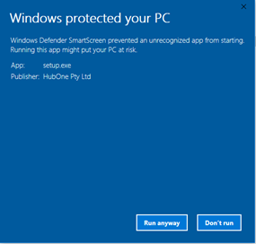
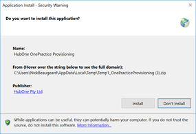
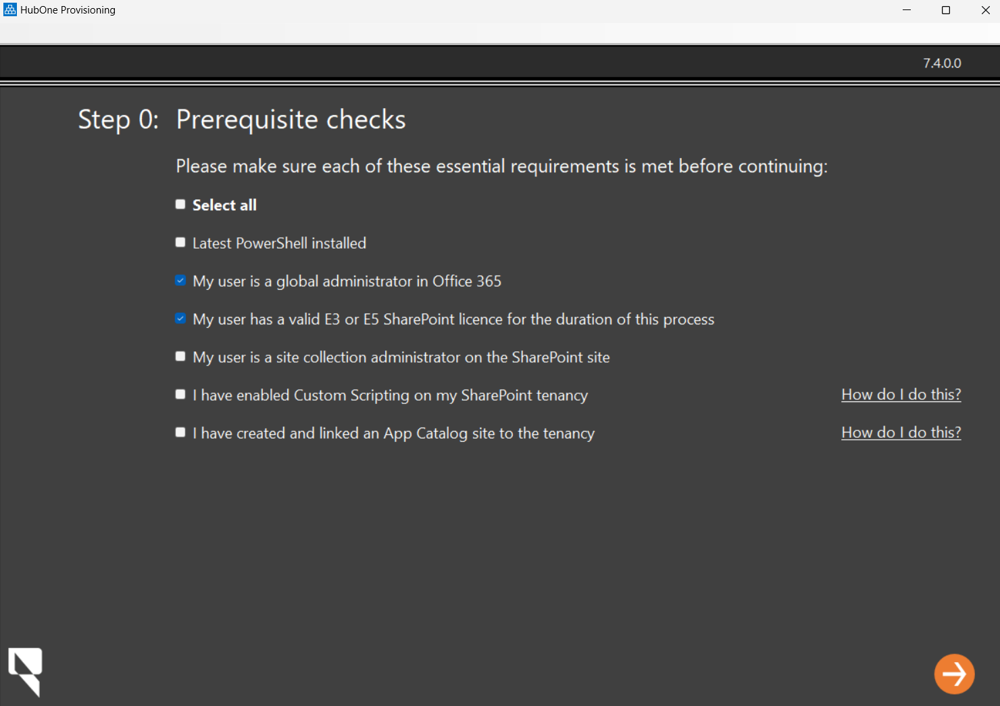
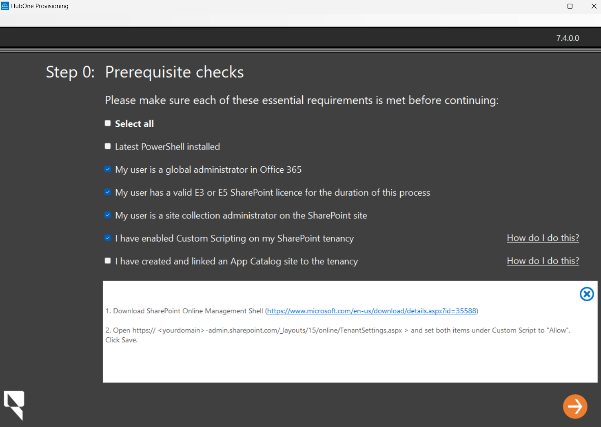
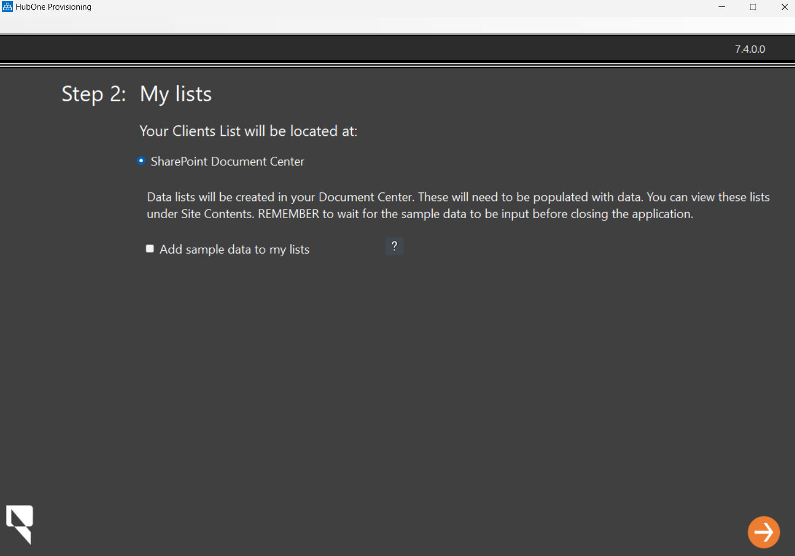
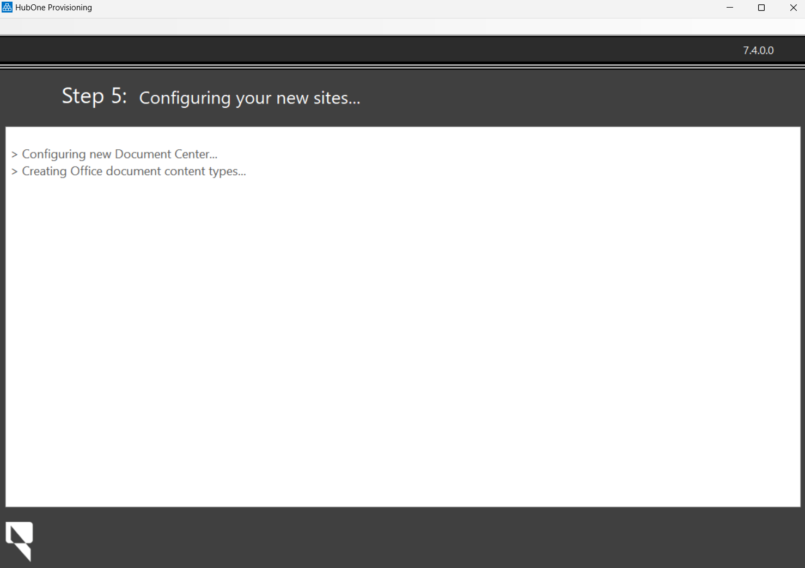
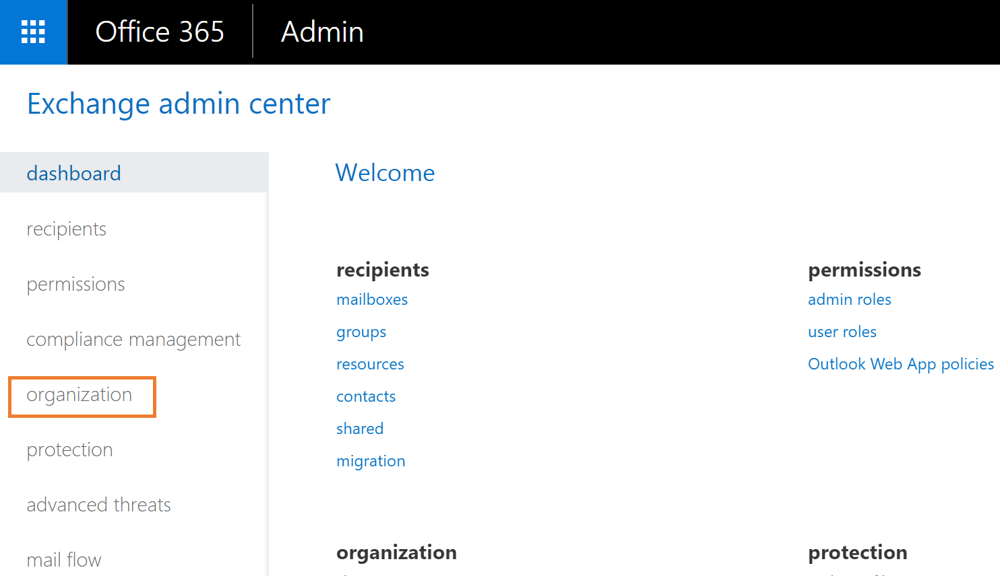

# Provisioning

Provisioning involves the installation and configuration of OnePractice in an existing Office 365 environment. OnePractice requires a clean SharePoint Online Site Collection and will use the root site.

Whilst the provisioning process does not delete files, it may change the look and feel of an existing chosen site collection, so take care when implementing it.

The following sections detail the steps to provision OnePractice:

- [Provisioning](#provisioning)
  - [Purchasing & Licensing](#purchasing--licensing)
  - [Installation of OnePractice PreRequisites](#installation-of-onepractice-prerequisites)
  - [Provisioning Process](#provisioning-process)
  - [OnePractice Sync Configuration](#onepractice-sync-configuration)
    - [Configure CCH Confguration](#configure-cch-confguration)
    - [Configure XPM Confguration](#configure-xpm-confguration)
  - [Post Provisioning](#post-provisioning)

## Purchasing & Licensing

In order to license OnePractice, please follow the procedure below:

1. Navigate to the [License form](https://form.jotform.co/73236397529871)

 <br/>

   1. Enter the Customer's Business Name.
   2. Enter the SharePoint URL **(Leave off https:// or http://)**.<br/>
   3. Enter the Partner Name.<br/>
   4. Enter the number of seats or users the customer has.<br/>
   5. Click Submit.

   2. Once submitted, you can continue with the provisioning process via the app

 <br/><br/>

3. You will receive an email once the license has been generated.

## Installation of OnePractice PreRequisites

The following procedure details how to install OnePractice prerequisites

1. Please send an email to <support@hubone.com> requesting a Provisioning Tool.
4. The application will be sent as a Zip file. Once it has downloaded, click the Zip File to extract.

   

5. Click Extract all in the zip file.

   
6. Once the files have been extracted, double click **setup**.
7. If you see the error message as shown below, check out this [Microsoft article](https://msdn.microsoft.com/en-us/library/ee308453.aspx) for instructions how to resolve.

   

8. If the Windows Defender App appears, click **More Info**

   

9. Click **Run Anyway**

    

10. Click **Install**

    

11. The OnePractice Provisioning Portal will download and install. When complete, there will be a pause and the dialog will disappear.

12. Shortly after the OnePractice Provisioning Manager will run.

<br/><br/>

13. If you are using a demo environment you just created, you can mark that user as a global administrator. If not, please confirm the user account you are using is a global administrator.

<br/><br/>

14. Ensure your user has a valid Office 365 license.
    You can check this by navigating to [https://portal.office.com/adminportal/home#/users](https://portal.office.com/adminportal/home#/users) and reviewing the user's role.
    If they do not have a license, assign a Business Premium, E3 or E5 license. Wait up to 30 minutes for Microsoft to apply the license then move to the next step.


15. Go back to the Provisioning Manager and mark that your user has a valid license.

<br/><br/>

16. Ensure your user is a SharePoint Site Collection Administrator.
    This will be true if you setup a new tenancy or if they are Global Administrators and have been granted site administration permissions in the SharePoint admin center.

<br/><br/>

17. Next, enable Custom Scripting on the SharePoint Library.

    **Please Note** The next step assumes you do not have the required components installed on your device. If this is the second time you have this procedure, you will not need to install new components.
18. To enable custom scripting click **How do I do this?** to obtain the latest instructions.

    Once you have the required components, these instructions assume you have a little proficiency in the use of PowerShell.

    Once you have completed the instructions, mark the checkbox

<br/><br/>

19. Next you will need to create a SharePoint App Catalog.

    Click **How do I do this?** next to the App Catalog checkbox to obtain a set of instructions.

    Once you have completed those instructions, mark the checkbox

<br/><br/>

**PROCEDURE COMPLETE**

## Provisioning Process

The following steps complete the installation of OnePractice

1. Go to Provisioning Manager and click the right arrow at the bottom of the page

<br/><br/>

2. Enter the following information:

   - **Tenant Admin URL** - The admin link for the client's SharePoint Site, e.g. ```https://mysite-admin.sharepoint.com```
   - **Admin User** - A global admin user login e.g. ```admin@<designator>.onmicrosoft.com```
   - **Admin Password** - the user's password
   - **Log File Location** - the provisioning tool creates comprehensive logs. Choose a location to store them.
  
    Once complete, click the Right arrow at the bottom.

<br/><br/>

3. The Provisioning Manager will check the Office 365 environment and permissions. Once complete, the next screen will appear.

<br/><br/>

   - For Production use, ensure **Add Sample data to my lists** is not checked, for test use, feel free to check that button

    Click the Right arrow at the bottom of the screen
4. Accept the defaults for portal URL, Document Center URL and Display Name.

<br/><br/>

   Complete the following:
   - **Configuration and Skin** - Choose the appropriate configuration and skin for the installation you are deploying.
   - **Company Specific Settings** - Upload the client's logo and change the helpdesk URL to your company's helpdesk UTL. Once done, adjust the time zone correctly.
   - **Metadata** - Add any desired Metadata fields
   - **Common App Settings** - Leave as default

    Once done, click the Right Arrow

5. The application will commence installing OnePractice

<br/><br/>

6. After some time, the dialog below will appear:

<br/><br/>


   Carefully follow the instructions on-screen.

   **WARNING** failure to correctly follow the instructions will result in an unsuccessful implementation.

   Once done, click the arrow to the right

7. The application will continue to configure the environment. Wait until it has completed, then when prompted, close the application.

<br/><br/>


8. Download the OnePractice Mail Manifest from <https://software.hubone.com/MailManager>


9. Navigate to Exchange Administration at <https://outlook.office365.com/ecp> and click **Organization**



10. Click **add-ins**, then click the **+** burron and select **Add from File**


11. Click **Choose File**


12. Browse for the manifest file you downloaded in step 8. Click **Next** and wait for the file to upload


13. Once done, Mail appears in the list.


13. Double click **Mail**, and choose **Mandatory, always enabled**

    Once done, click **Save**
    

**PROCEDURE COMPLETE**

## OnePractice Sync Configuration

### Configure CCH Confguration

1. Navigate to <https://practicesync-staging.azurewebsites.net>
2. Click **Login with Microsoft**
3. Click **Accept** to accept the credentials
4. Choose the DocumentCenter and click **Configure**
5. Enter details as shown below and click **Connect** under CCH iFirm
    
6. Enter the Username and password from your CCH iFirm Environment and Click **Login** then click *Yes**

### Configure XPM Confguration

1. Navigate to <https://practicesync-staging.azurewebsites.net>
2. Click **Login with Microsoft**
3. Click **Accept** to accept the credentials
4. Choose the DocumentCenter and click **Configure**
5. Click Connect XPM
6. Login as your XPM Username and password
7. Choose the Practice Manager Account to Subscribe to
8. Select the XPM Tenant

    

9. Click Create Sync Schedule
10. The System will attempt to Synchronise

    

11. When Sync is complete, you can close the browser and return to testing the applications.

    

## Post Provisioning

Post Provisioning you should install Scans on computers which require it. See [Scans](scans.md) for more information.
