# Scans
Scans provides the means to significantly reduce the time spent by your staff filing scanned documents (or searchable PDF files) to client folders into SharePoint. 

The app combines state-of-the-art technologies to intelligently read, categorise and file scans from your scanner and organise them in SharePoint according to options you have configured. 

The following sections detail how to use Scans

- [Scans](#scans)
  - [Getting started](#getting-started)
    - [Installation](#installation)
    - [First Run](#first-run)
  - [Basic Usage](#basic-usage)
  - [Manual Processing](#manual-processing)
    - [Document Summary](#document-summary)
    - [Edit Document Details](#edit-document-details)
    - [Client Search](#client-search)
    - [Edit Metadata](#edit-metadata)
    - [Preview Document](#preview-document)
    - [Process Later](#process-later)
    - [Delete](#delete)
    - [Save to DropOff](#save-to-dropoff)
    - [Save to Client](#save-to-client)
  - [The Controls](#the-controls)
    - [Drag and Drop](#drag-and-drop)
    - [Process History](#process-history)
    - [Reprocess Documents Only](#reprocess-documents-only)
    - [Refresh and Reprocess](#refresh-and-reprocess)
  - [Settings](#settings)
    - [Processing Settings](#processing-settings)
      - [PDF Processing Mode](#pdf-processing-mode)
      - [Common App Settings](#common-app-settings)
      - [Global MetaData](#global-metadata)
    - [Client Matching Rules](#client-matching-rules)
      - [Field Matching Options](#field-matching-options)
      - [Word Equivalency](#word-equivalency)
      - [Exclude Clients](#exclude-clients)
      - [List Cache](#list-cache)
    - [File Renaming](#file-renaming)
      - [Standard Rules](#standard-rules)
      - [Custom Rule Builder](#custom-rule-builder)
      - [Append or Prepend](#append-or-prepend)
    - [Import and Export](#import-and-export)
    - [Clear All Settings](#clear-all-settings)
  - [Connection](#connection)
    - [Essential Connection Settings](#essential-connection-settings)

## Getting started

### Installation
1. Connect to https://software.hubone.com/OnePracticeScans/ and click Download Application.
2. Once downloaded, open the folder and click Extract all. Once extracted, double click setup.
3. Click **Install**

    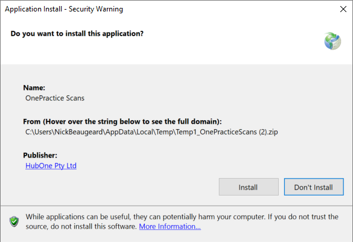

4. Once complete, Scans will be installed.

> Scans uses Microsoft Click-Once technology which ensures your software is always kept up to date. Every time you run Scans, it will check to see if there are updates and if there are, the software will prompt you to update.

### First Run

The first run of Scans will require you to enter the following:

- Location of your document center
- A local folder to store the scanned documents

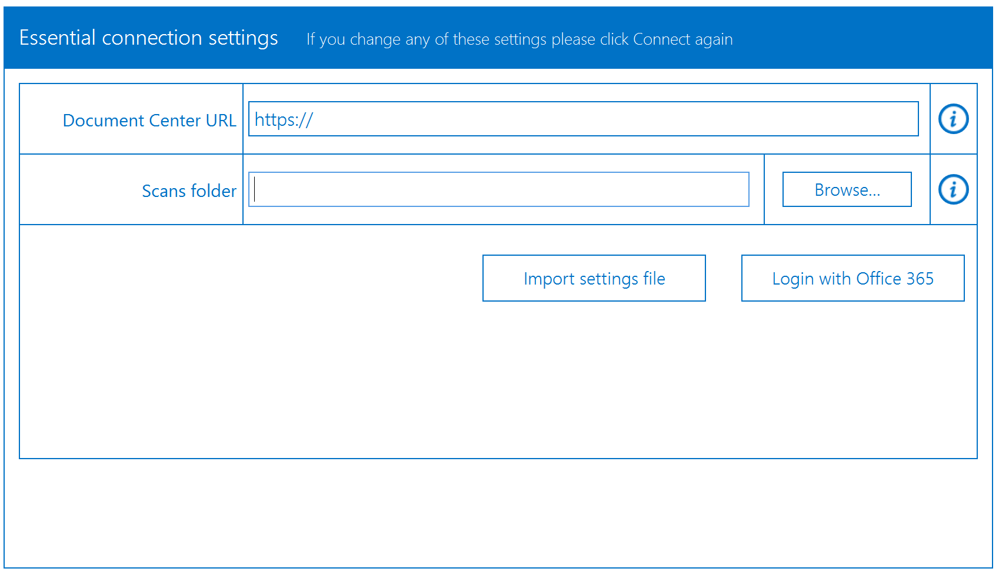

When complete, click **Login with Office 365**.

If you're not already logged into Office 365 in your browser, a popup window will appear and ask you to enter your username and password. You will be logged in and the popup will disappear. 

If you are already logged into Office 365 in your browser, the popup will appear, verify your credentials, complete the log in automatically and disappear.

> **Note** you can also Import and Export Settings

*All scanners have the facility to store scanned documents in a folder on a computer. To facilitate the operation of Scans, we recommend configuring your scanner as follows:*

1. *Document to Create: **Searchable PDF***
2. *Location to Save - Choose the local folder as above.*

Once you have completed the above settings, the application will look as per the image below:

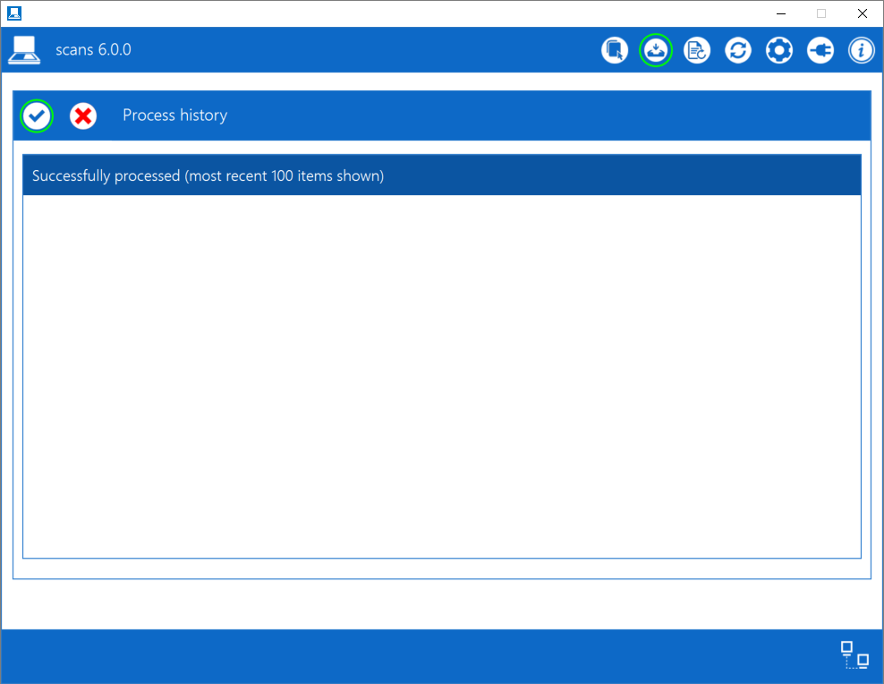

## Basic Usage

If you have configured Scans to work with your scanner correctly, simply scan a document and the following screen will appear:

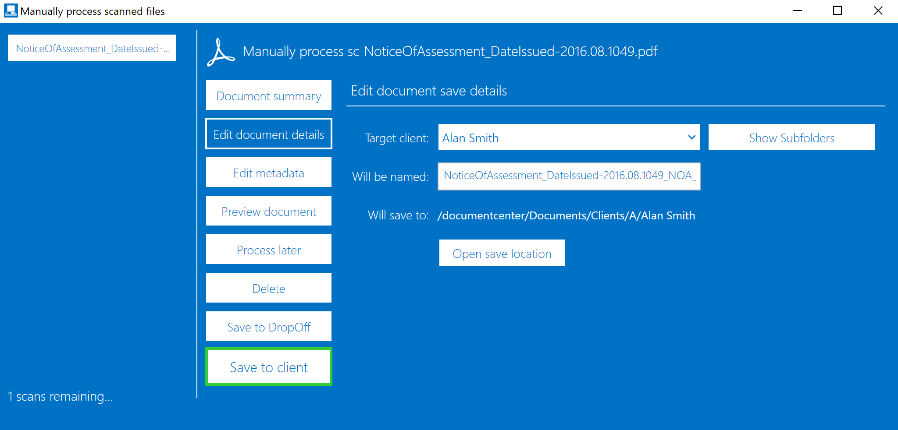

This is **[Manual Processing](#manual-processing)**, and it allows you to control aspects of the file via the app before it saving. There is also the option for automatic matching but this should only be activated once you have a high degree of automatic success in Manual Processing.

In common operation, you will just click **Save to client**. However the following options are available.

- Document Summary - Provides information on the document.
- Edit document details - Allows editing of some document information including client and sub-folder.
- Edit metadata - Allows the entering and modification of metadata.
- Preview document - Allows the preview of the document.
- Process later - Does not process the document.
- Delete - Deletes the document.
- Save to DropOff - Saves to the DropOff Library.
- Save to client - Saves to the Client Folder as matched.

## Manual Processing

Manual processing mode is the default mode of operation for Scans. It allows for the verification of matching and other aspects before saving files.

The section on the left displays the list of scanned documents to be processed, as well as a count at the bottom. You can configure the number of documents listed here by updating the PDF processing setting. By default, a maximum of 6 can be displayed.

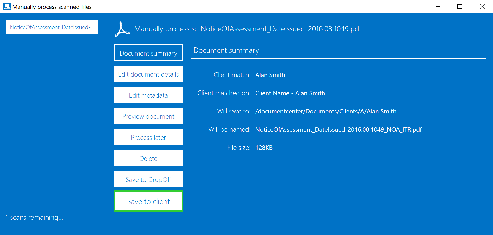

The different options are shown below:

### Document Summary

The Document summary tells you information about the document including:

- **Client Match** - The client matched by the software from information in the document.
- **Client Matched On** - Which field was used for matching.
- **Will Save to** - Which location the file will be saved to assuming the user clicks Save to client.
- **Will be named** - The final file name upon saving.
- **File Size** - The size of the file.

### Edit Document Details

The Edit document details section allows you to edit details about the document as follows:

- **Target Client** - Here you can change the client you wish to save to. Learn more about searching for the target client
- **Show Subfolders** - Shows subfolders (if any) for the specific chosen client folder.
- **Will be named** - This is the name of the file and you can simply edit it here.
- **Open Save Location**  - Opens the client folder (or subfolder) in your default browser.

### Client Search

If Scans has been unable to identify the client in your scanned document or it has detected a different entity, you will need to search for the client. 

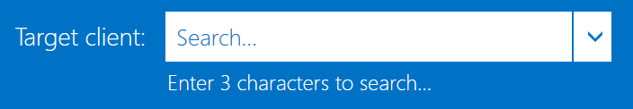

Start by typing 3 characters into the search bar. 

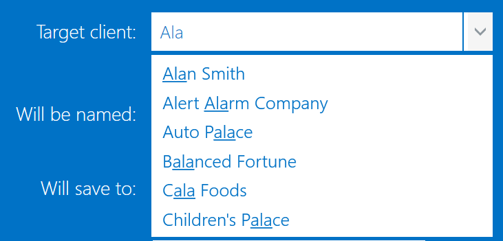

A list will appear showing all clients that contain those 3 characters. You will also see a line under characters that match your search criteria.

As you type more characters, the list is refined. 

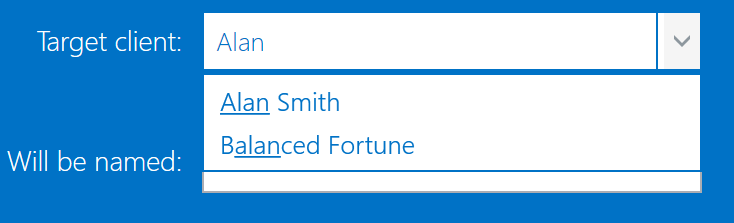

The list will also show clients within client groups that contain those characters. So even if the client name does not contain the searched characters, if the group does, you'll see a list of clients within the matched group.
| | |
| -- | -- |
 | 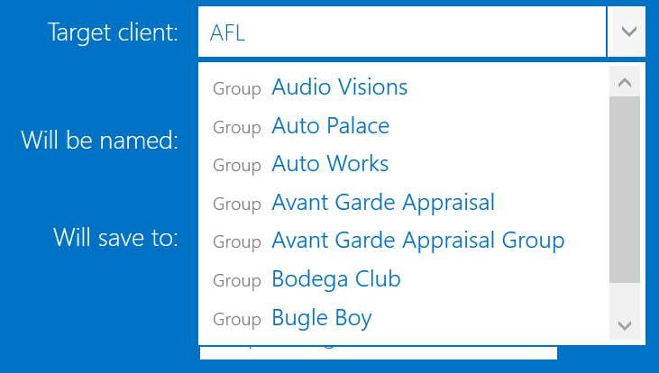 | 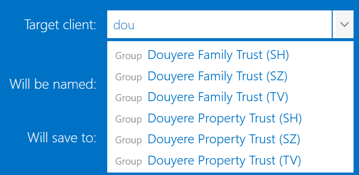 |

 If you hover over the list, you'll see which client group the client belongs to.

 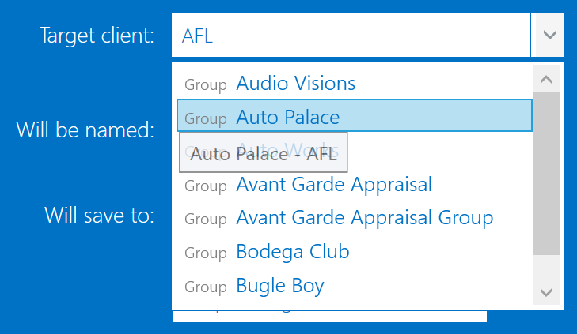

### Edit Metadata
The Edit metadata section allows you to edit the contents of metadata. You can set metadata globally using the setting at Global MetaData. 

Metadata is used to set information about the document that can be used later for simple search and filter to locate specific documents. 
Learn more about [metadata](metadata.md)

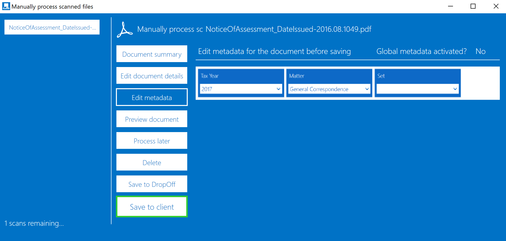

### Preview Document

The Preview document section allows you to simply preview and print the document.

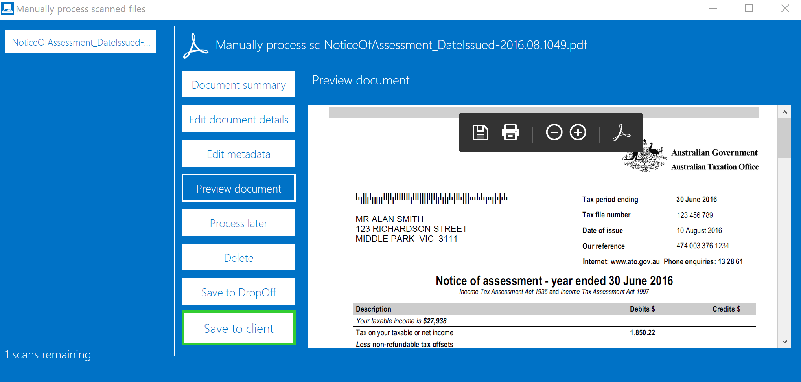

> Please note, this is not a real notice of assessment. It has been created to demonstrate OnePractice Scans functionality.

### Process Later

Choosing **Process later** means the document will be left in the folder until the Reprocess Documents Only or Refresh and Reprocess controls are clicked.

### Delete

Choosing Delete means the document will be deleted from your machine. You will need to scan the document again if you decide you want to process it. 

### Save to DropOff

Choosing Save to DropOff saves to the DropOff Library. Users configured as DropOff Administrators will be alerted to these documents and will need to file them.

You can find out more about the DropOff Library here: http://sharepointmadam.blogspot.com.au/2015/02/drop-off-library-setup-guide.html

### Save to Client

Choosing Save to Client saves the document to the Client Folder in the Document Center and moves a copy to the SDMUploadCompleted folder under your scans folder.

## The Controls

The following are controls in Scans:

 - Drag and Drop
 - Process History
 - Reprocess Documents Only
 - Refresh and Reprocess
 - Settings
 - Connection

### Drag and Drop

Drag & Drop allows you to drop searchable PDF files for the application to process.

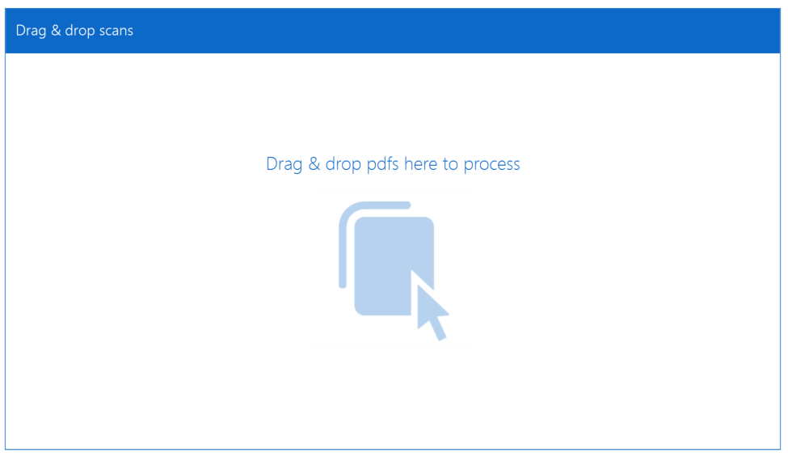

### Process History

Process History shows the last 100 successful and 50 unsuccessful documents. Click the tick to see the successful files and the cross to see unsuccessful files.

For each file you can Open file location which opens the folder in your default browser or Open file which opens the file in your default PDF viewer application.

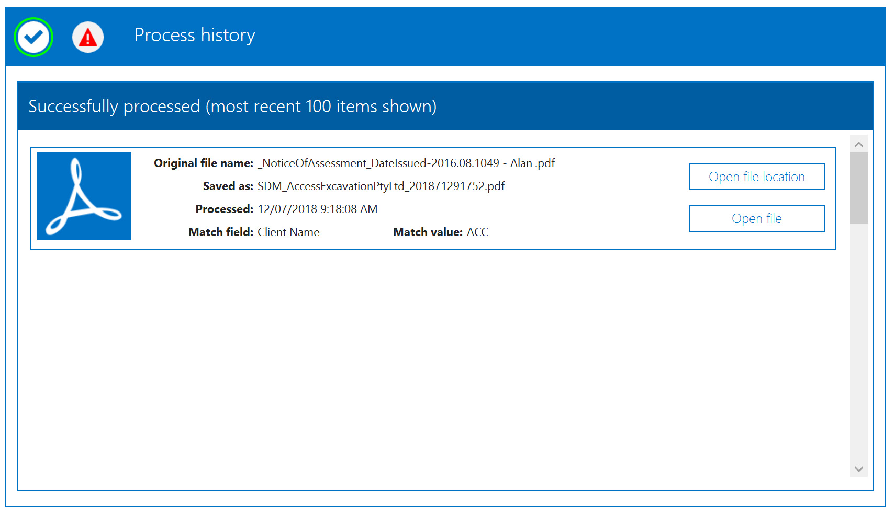

### Reprocess Documents Only

Reprocess Documents only instructs the system to re-attempt any documents that have not been successfully processed, for example ones where Do not process was selected. This allows you to process a large number of documents and skip ones you are unsure of and deal with them later.

### Refresh and Reprocess
Refresh and reprocess performs the following tasks:

1. Verification of all settings and credentials
2. Re-download and caching of the client list
3. Re-processing of any documents that have not been processed or are marked do not process

This is useful if a new client has just been added and is not yet showing in the application. 

## Settings

The Settings control allows you to configure various areas of the application. Clicking settings defaults to Processing Settings.

The following are available settings:

 - Processing Settings
 - Client matching rules
 - File Renaming

From here, you can also import and export settings, and clear all settings. 

### Processing Settings

The following settings are available under processing settings

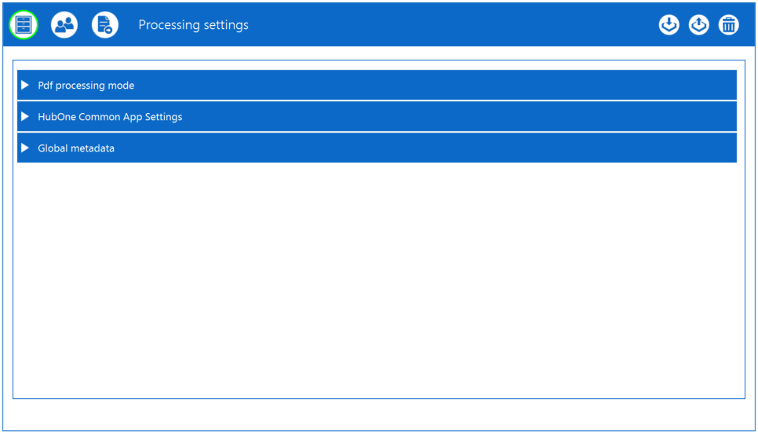

#### PDF Processing Mode

PDF processing mode allows you to choose between automatic processing mode where files are automatically saved to the chosen client folder, or Manual Processing.

You can also increase or decrease the number of documents that are visible in the processing window. The maximum number is 20 documents however, by default it will be set to 6. To increase or decrease the amount, click on the up and down arrows. 

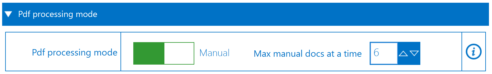

#### Common App Settings

Common App Settings shows the configuration of your <%PRODUCT_NAME%> environment.

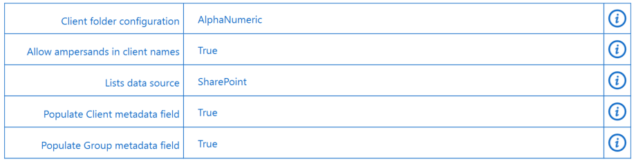

The settings are as follows:

- **Client Folder Configuration** - This is either Standard or Alphanumeric. Standard is where all client folders are listed directly under the main Clients folder. Alphanumeric means there are subfolders under the Clients folder (0-9 and A through Z) - this is typically used where total Clients > 5000 or may exceed 5000.
- **Allow Ampersands in client names** - This is either True or False, meaning the & symbol is allows or replaced with the string 'and'
- **Lists Data Source** - Details where the current client data is coming from. In the case above, SharePoint Lists.
- **Populate Client metadata field** - If True, will automatically populate the Client Name metadata field when saving a document.
- **Populate Group metadata field** - If True will automatically populate the Group metadata field when saving a document.

#### Global MetaData
Global metadata allows you to set metadata for all filed scans to pre-determined values you set. This can be over-ridden in manual processing mode or be turned off here.

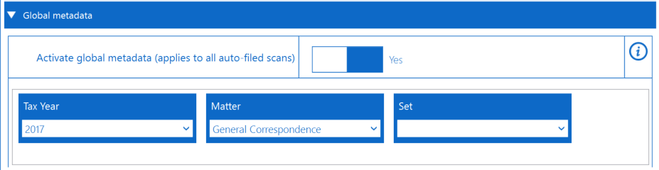

### Client Matching Rules

Client Matching rules are the rules whereby Scans matches the Client to the document.

There are a number of options to allow you to fine-tune Scans:

- **Field matching options** - These determine which fields are used to match the document.
- **Word Equivalency** - This deals with identical words or phrases which can be spelled differently
- **Exclude Clients** - This allows you to specifically exclude clients (such as the internal client)
- **List Cache** - This shows the current cached client list and allows you to manually refresh it.

#### Field Matching Options

Here you can choose which fields the app uses to match clients'  Name is on by default, but you can also choose any field available. 

Simply click on the field to select, click again to deselect.

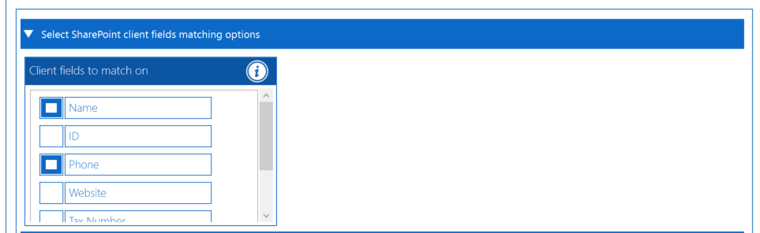

#### Word Equivalency

Using word equivalency allows you to match abbreviations and other items.

To add an item, click the + button. 

To remove an item, click the - button.

> **Note:** Scans comes with a robust set of word equivalency options built in.

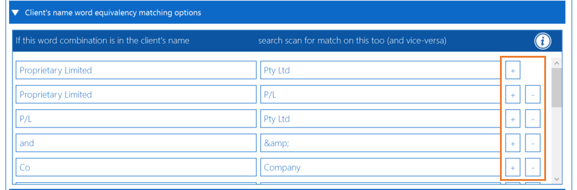

#### Exclude Clients

Many accounting practices have their firm included in their practice management system as one of the clients. To exclude that from matching, use the Exclude Clients Option:

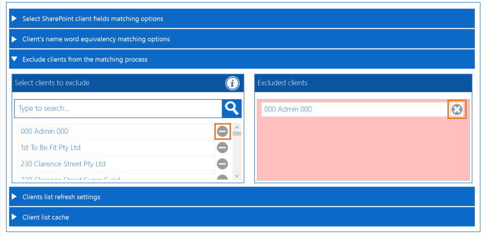

#### List Cache

The list cache shows all the clients currently cached on your PC. If a client is missing, for example it was created recently, click Refresh Clients to refresh the list and rebuild the cache.

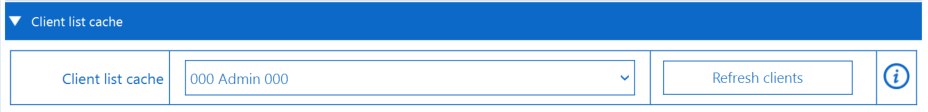

### File Renaming
File renaming allows the setting of the file name during upload based on rules.

The screen shows the rule that would be applied.

For example:

You can change these rules using the following methods:

- **Standard Rules** - Allows for simple rules to rename a file.
- **Custom Rule Builder** - Allows for complex rules to rename a file.
- **Append or Prepend** - Allows a file name to have something appended or prefixed based on rules.

#### Standard Rules

Standard rules allows the following:

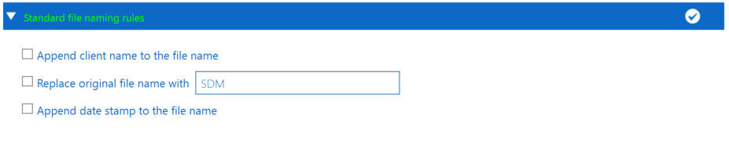

- **Append client name to the file name** - Takes the existing file name and adds the client name to the end.
- **Replace original file name with** - Replaces with existing file name with a string of your choice.
- **Append date stamp to the file name** - Adds a date stamp to the file name at the end.

#### Custom Rule Builder

The custom rule builder allows you to construct file names as you require. You can choose from or remove the following:

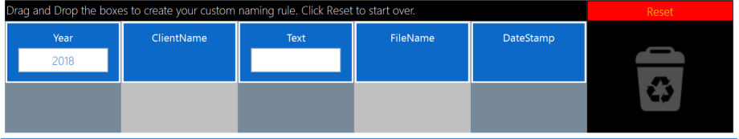

- **Year** - The current calendar year
- **ClientName** - The matched name of the client
- **Text** - Any text of your choice
- **Filename** - The original file name
- **DateStamp** - The date stamp the file is being saved

The reset button reverts to the view above.

#### Append or Prepend

This feature allows you to append or prefix your files with a word based on words found in the document:

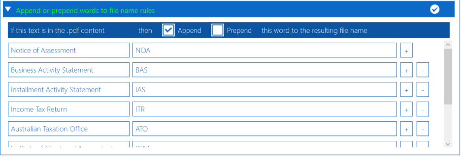

For example, if we found "Notice of Assessment" in the document, we would append NOA to the filename.

Use the + and - buttons to change these options.

### Import and Export

The Import and Export Settings icons allow you to import and export all settings except user credentials:

- Import
- Export

Clicking on either button will present a file picker for you to choose the specific file to load or name and save as:

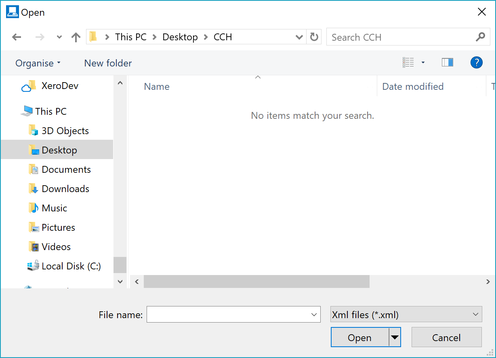

Settings are saved as XML files.

### Clear All Settings
The Clear all settings button removes all settings.

## Connection
The Connection Icon shows the Essential Connection Settings.

### Essential Connection Settings

The Essential Connection Settings are the three items required to operate (at a minimum) Scans and are:

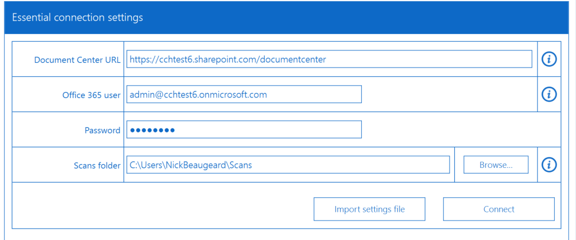

- URL of the Document Center
- Office 365 Credentials
- Local Scans Folder

