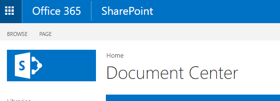
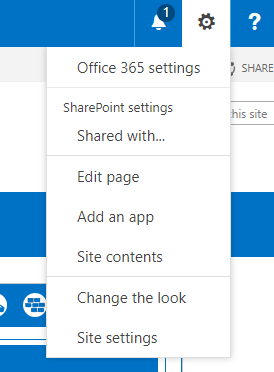
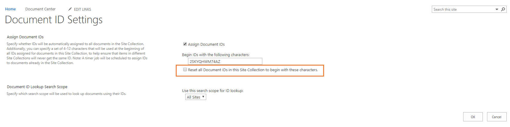

# SharePoint Site

<%PRODUCT_NAME%> relies on a configured SharePoint Site to operate properly and the provisioning tool assists with its configuration. 

The following manual details the configuration of the SharePoint Site and what the various configurations do.

- [SharePoint Site](#sharepoint-site)
  - [Document Center](#document-center)
    - [Documents Library](#documents-library)
    - [Document ID Service](#document-id-service)
  - [Lists](#lists)
    - [HubOne Common App Settings](#hubone-common-app-settings)
    - [Refresh List Frequency Setting](#refresh-list-frequency-setting)
      - [Updating the HubOne Common App Settings](#updating-the-hubone-common-app-settings)
    - [Clients List](#clients-list)

## Document Center

The Document Center site contains all client documents and templates.

### Documents Library

The Documents Library is a standard SharePoint document library except:

- The Clients folder is critical. It must be be named Clients and is case sensitive. All client folders will be created by the system under this.
- The Content Organizer is enabled but not configured.
- Versioning is enabled, but the requirement for check-in and check-out is not.

### Document ID Service

The Document ID Service is enabled and creates a unique ID for each document.

To configure the ID Service to be more user friendly:

1. Navigate to the Document Center.
    
2. Click the Settings Cog in the top right and choose **Site Settings**.
    
3. Choose **Go to top level site settings** under Site collection Administration.
    
4. Choose **Document ID settings** under **Site Collection Administration**
5. Change the characters to something meaningful and select Reset all Document Ids in this Site Collection to begin with these characters tick box. Please note, we recommend changing this as soon as you configure the new SharePoint site and advise against changing at a later date. If you are unsure or would like to change the Document ID settings, please contact your systems administrator.
    

## Lists

Lists store key information that allow the various applications to function correctly. 

The following lists exist in the current version of OnePractice

### HubOne Common App Settings

The Common App Settings Table contains configuration for all <%PRODUCT_NAME%> apps and is established via the Provisioning tool.

These settings should not be altered after the initial configuration by the provisioning tool. If you would like to make a change, please contact your system administrator. 

The settings can be modified and are as shown below:

| Setting | Options | Description |
| -- | -- |--
| TemplateMan_WorkflowMaxAccountKey | The XPM, Xero Tax or WorkflowMax Account Key | No longer used |
| ModernPractice_FolderConfig | Standard or Alphanumeric | Standard is where all client folders are listed directly under the main Clients folder. Alphanumeric means there are subfolders under the Clients folder (0-9 and A through Z) - this is typically used where total Clients > 5000 or may exceed 5000. |
| ModernPractice_UseSubFolders | True or False | If True, the option to choose subfolders will appear in apps. If False, it will not. |
| ModernPractice_ServiceLocation | AU or NZ | This setting is now obsolete. It was used to work with AU or NZ XPM, Xero Tax or WorkflowMax Accounts. |
| OP_UserSharePointLists | True or False | If True, the apps will use SharePoint Lists as the data source. E.g. when connecting to practice management systems, including XPM, Xero Tax or WorkflowMax. |
| OP_AllowAmpersands | True or False | If False, all names from the Practice Management system that contain the ampersands character (&), will be replaced with the word and. |
| RefreshClientListFrequency | 0-90 | The number (in days) between the auto refresh of client lists. If 0, the client list will not refresh automatically. |
| Skin | CCH, CAKairos, OnePractice | The look and feel of the applications. |
| PopulateClientMetadataField | True or False | If True, it will attempt to populate the Client Metadata field on Save. | 
| PopulateGroupMetadataField | True or False | If True, it will attempt to populate the Group Metadata field on Save. |
| RefreshListFrequency| 0-90 | The number (in days) between auto refresh of lists. If 0, the lists will not refresh automatically. | 
| DoNotShowMetadataColumns | Client, ClientGroup, Group1 | This will prevent the metadata columns listed from appearing in the individual apps. You can edit this item to add more metadata columns. Ensure you use commas to separate the values. |

### Refresh List Frequency Setting

All of the applications store a cache of all your clients and jobs in your local browser after its first load. This is to minimise loading time and to give you a more efficient experience. However, this means that from time to time you will need to refresh your clients and jobs lists to reflect changes in your data source (e.g. Xero Practice Manager, SharePoint or another source).
 
You can do this manually by clicking the Refresh icon in the application header bar or you can set a refresh schedule in your HubOne Common App Settings list in your SharePoint Document Center.
 
#### Updating the HubOne Common App Settings
 
1. Open your SharePoint Document Center > Settings Cog > Site Contents > HubOne Common App Settings (list)
2. Click Quick Edit
3. Scroll down until you find the line item RefreshListFrequency
In the SettingValue column, set its value to:
“0” if you wish to never refresh or only refresh manually or;
A number value (1 – 100) to indicate the number of days between each automatic refresh.
 
Once the application passes the desired refresh schedule time, it will automatically refresh and reload your clients and jobs lists from their respective data sources. Please be patient if your data source is large.
 
> **Note** This is an administrator-level change, not a user level change. Administrators should set the permissions of the HubOne Common App Settings to Read-Only for most users.

### Clients List

The Clients list contains information regarding clients in the practice management system and consists of the following fields:

| Title |
| -- |
| Client Name
| Client ID
| Date Of Birth
| Email
| Phone
| Primary Contact Name
| Primary Contact Addressee
| Primary Contact Salutation
| Primary Contact Email
| Primary Contact Mobile
| Primary Contact Phone
| Tax Number
| Partner
| Manager
| Client Group
| BankAccountName
| BankBSB
| BankAccountNumber
| Post Code
| Postal Address
| Postal City
| Postal Country
| Postal Post Code
| Postal Region
| Address
| Region
| City
| Country
| Post Code
| Business Number
| Company Number
| Prepare GST
| Primary Contact Position
| Referral Source
| Website
| Export Code
| Signed Tax Authority
| GST Registered
| Agency Status
| Is Archived
| Is Prospect
| Account Manager ID
| Account Manager Name
| Job Manager ID
| Job manager Name
| is Deleted
| Bank Name

