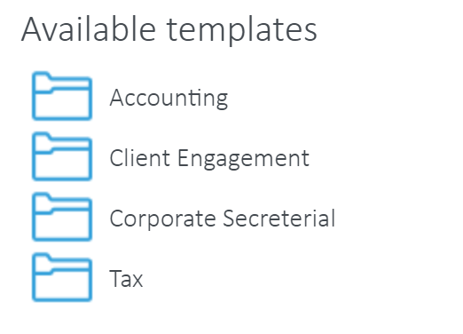
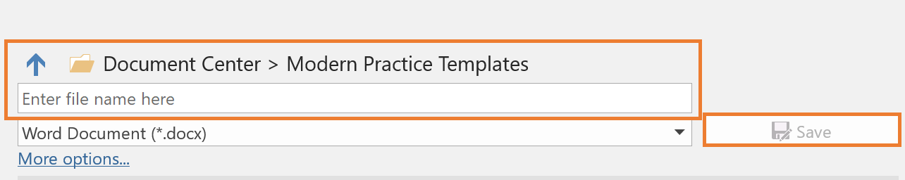

Templates consists of two discrete applications [Mail Templates](mail-templates.md) which operates in Outlook and [Templates](r-templates.md) which operates in SharePoint.

- [Templates](#templates)
  - [Getting Started](#getting-started)


# Templates

Templates provides you with a central template store within your SharePoint Document Center so you can have a unified and consistent approach to work, reduce human error and produce documents far faster than ever before. 

Unlike many other template tools, Templates facilitates powerful and easy integration between Microsoft Office Word or Excel documents, and client or job data from a CRM or Practice Management software, thereby saving even more of your time.

Templates allows you to create templates with an easy-to-use tag builder extracting from data sources and share instantly with your team. From there, you can produce documents in seconds.

As well as automatically populating pre-defined fields, you can prompt users to input ad-hoc information before the document is filed into the specific client folder in SharePoint.

What’s more, Templates appears by default on your Document Center and incorporates seamless automatic updating so you always have the latest version available.

The following sections detail how to use Templates:

## Getting Started
Templates is installed by default on the homepage of your SharePoint Document Center.

On first run, the application will load your clients and jobs lists and store (cache) them locally in your browser for quick access later on. Please be patient, as this can take up to a minute depending on the volume of data. Once this process completes, the application will notify you if there are no templates in your templates directory.

To locate or add templates, click on the Upload Templates button and you will be redirected to the Modern Practice Templates folder.


You can also navigate there as follows:

**Settings Cog (as shown below) > Site Contents > Modern Practice Templates.**


Any MS Word .docx or Excel .xlsx document placed in this directory will appear in the Templates app (after clicking refresh in the controls bar of the Templates).


If you organise your templates into folders, this will also display in the Templates app. 



## The Controls
The controls can be accessed via icons at the top of the application.

They are:

-  View Saved Documents
-  Upload Templates
-  Template Field Builder
-  Refresh
-  Settings
-  Help

### Recently Saved Documents

View recently saved documents and links to those files and the folder it was saved to in your Document Center.


### Upload Templates

The Upload Templates button will open a new browser window and redirect you to the Modern Practice Templates folder. Here you can upload new Word or Excel templates, as well as remove, move and edit templates.


### Template Field Builder
Create Standard, Custom Prompt and O365 User Info fields that you can easily copy and paste into your Microsoft Office template file.

The dropdown options will display all Client, Job and Custom fields you have available within your CRM or Practice Management software, as well as assist you when building complex Custom Prompt fields, which prompt users to enter additional ad-hoc information when merging the template with client or job data. O365 User Info fields look at the user's Office 365 profile and can input information such as name, phone number, email etc. 


### Refresh
As Templates caches data locally in your internet browser to reduce network traffic and greatly speed up its functionality, it needs to be refreshed from time to time to pick up changes in your client/job data and locate newly added templates. 

Your administrator may have configured the system to automatically refresh. If so, you will not need to do this.

### Settings
View essential settings retrieved from your SharePoint Document Center.

> **Note:** you cannot amend your settings via this app directly. To update settings, please see Common App Settings, within our [Administrator Guide](admin.md).

The 365 user info enabled setting shows whether you have MS info fields enabled. It should display either False or True - <Your Name>


### Help
A link to the software help website where you can download the complete Templates Documentation.

## Field Builder Options

There are 3 types of template fields: Standard, Custom and O365 User Info 


### Standard Template Field
Standard template fields are used to merge Practice Management client or job data with your template. When the final document is being produced, Templates will extract the appropriate data from your data source for a selected client. 

The fields can also be **Basic** or **Complex** 

**Basic** is when you only use a tag available in the ‘Field’ dropdown. 

**Complex** includes the use of alternative and default field tags, separated by pipe-characters, to extract different information if data is missing for the main tag. Please note, when using alternative options two pipe characters (|) are required in the form: 

```Field | Alternative Field | Default Text``` 

For example, if your document contained: Dear ```«Client Full Name|Client First Name|Loyal Customer»```

- The chosen Field data will be used to populate the document - (Dear James Smith)
- If Templates cannot detect any data in the chosen field, it will then populate the document with data found in the chosen Alternative Field - (Dear James)
- If Template cannot detect any data in either the field or alternative field, the text you have entered in the Default Text area will be used to populate the document - (Dear Loyal Customer)

Please note, the special characters are used to separate the fields. 


### Custom User Prompt Field
Custom Prompt template fields are used to prompt the user for information before the document is fully populated. 


- **Text & Multi-Line Text** - the user must input plain text. 
- **Number** - the user must input a number. 
- **Number Range** - the user must enter a number within the set range. 
- **Date** - the user must select a date from the calendar. 
- **Yes or No** - the user must select either a Yes or No answer. However, you are able to customize the Yes or No text.
- **Choice** - the user must choose from a list of options. 

### O365 User Info Field
O365 user info fields are used to merge the logged-in user's  account information with templates. The feature was designed to allow you to personalize templates by signing them off as the individual creating the document, rather than on behalf of someone else or having to use custom data or edit once created. 

These fields include:
- First name
- Last name
- Full name
- Email
- Work phone
- Home phone
- Mobile
- Job title


You will have to upgrade the security level permissions on Templates to be able to include these fields. If you do not see this feature, follow a simple procedure [here](KB-Activate.md).

### Field Examples

| Standard Examples | Custom Prompt Examples |
| -- | -- |
| Basic<br/>```«ClientName»```<br/>```«JobName»``` | ```##Please enter Tax Year?~~Text##```<br/>```##How old are you?~~Number­Range~~18|80##``` |
| Complex<br/>```«ClientPostalAddress|Client Address|No Data Available»``` | ```##Are you registered with the ATO?~~Boolean~~Yes|No##```<br/>```##Where did you hear about us?~~Choice~~Bing|Google|Other##``` |

## Creating Templates
Templates can be created in 2 ways - Online or on your desktop. 

All templates must be saved in the Modern Practice Templates folder within your Document Center. 

Templates are saved to the folder differently, depending on how they are created.

### Part 1: Creating new Templates

#### Creating from your Desktop
Open Word or Excel on your PC. Move onto [Part 2](#part-2-adding-field-tages-to-templates)

#### Creating Online
1. Open your preferred browser and navigate to your Document Center  (https://<designator>.sharepoint.com/documentcenter/)
2. Select the Upload Templates button in the Templates app. This will open a new browser window with the Modern Practice Templates folder.

    

    

3. Click + New 
4. Select Word Document or Excel Document. Then move onto Part 2.
    


### Part 2: Adding Field Tages to Templates

1. Add content to the document and style as desired. 
2. Go to the Templates app in your Document Center and click on the bricks icon to access the field builder and generate the required field tag.
3. Copy and paste the tag into your document. Alternatively, if you already know the tag, you can manually type it. 
    
    You can also add SmartArt, Shapes, Text Boxes and Tables to Word templates and include field tags inside.
    
    **Note:** the angle brackets must match these exactly so it is best to either copy from this document or use the powerful Template Field Builder control accessed via the Controls Bar. 
4. Once you are happy with your document, save your template.

### Part 3: Saving Templates
Templates are saved differently depending on how they are created:

- Modern Practice Templates folder > Online (Saves automatically/as-you-go)
  Creating the template via the Modern Practice Template folder means your template will be saved as yougo. 
  
  Make sure you check the template changes from Saving... to Saved before you close or navigate away from that page. 
  
  
- Desktop > Save directly into the Modern Practice Templates folder within the Document Center
    - Within Word or Excel Desktop go to **File -> Save As**
    - Click on the **SharePoint** icon
    - Navigate to the **Document Center > Modern Practice Templates** folder
    
    - Open the folder and navigate to the desired folder.
    - Name the template and click Save.
    
- Desktop > Save to Desktop > Upload to Modern Practice Templates in your Document Center

