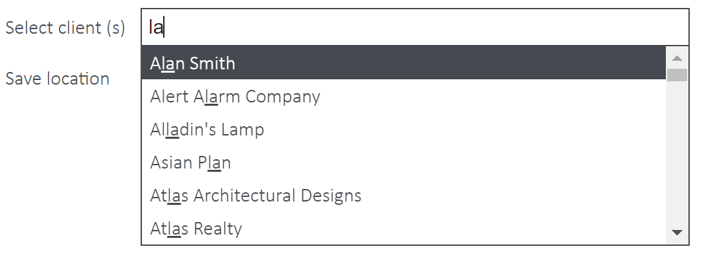

Templates consists of two discrete applications [Mail Templates](mail-templates.md) which operates in Outlook and [Templates](r-templates.md) which operates in SharePoint.

- [Templates](#templates)
  - [Getting Started](#getting-started)


# Templates

Templates provides you with a central template store within your SharePoint Document Center so you can have a unified and consistent approach to work, reduce human error and produce documents far faster than ever before. 

Unlike many other template tools, Templates facilitates powerful and easy integration between Microsoft Office Word or Excel documents, and client or job data from a CRM or Practice Management software, thereby saving even more of your time.

Templates allows you to create templates with an easy-to-use tag builder extracting from data sources and share instantly with your team. From there, you can produce documents in seconds.

As well as automatically populating pre-defined fields, you can prompt users to input ad-hoc information before the document is filed into the specific client folder in SharePoint.

What’s more, Templates appears by default on your Document Center and incorporates seamless automatic updating so you always have the latest version available.

The following sections detail how to use Templates:

## Getting Started
Templates is installed by default on the homepage of your SharePoint Document Center.

On first run, the application will load your clients and jobs lists and store (cache) them locally in your browser for quick access later on. Please be patient, as this can take up to a minute depending on the volume of data. Once this process completes, the application will notify you if there are no templates in your templates directory.

To locate or add templates, click on the Upload Templates button and you will be redirected to the Modern Practice Templates folder.


You can also navigate there as follows:

**Settings Cog (as shown below) > Site Contents > Modern Practice Templates.**


Any MS Word .docx or Excel .xlsx document placed in this directory will appear in the Templates app (after clicking refresh in the controls bar of the Templates).


If you organise your templates into folders, this will also display in the Templates app. 


## The Controls
The controls can be accessed via icons at the top of the application.

They are:

-  View Saved Documents
-  Upload Templates
-  Template Field Builder
-  Refresh
-  Settings
-  Help

### Recently Saved Documents

View recently saved documents and links to those files and the folder it was saved to in your Document Center.


### Upload Templates

The Upload Templates button will open a new browser window and redirect you to the Modern Practice Templates folder. Here you can upload new Word or Excel templates, as well as remove, move and edit templates.


### Template Field Builder
Create Standard, Custom Prompt and O365 User Info fields that you can easily copy and paste into your Microsoft Office template file.

The dropdown options will display all Client, Job and Custom fields you have available within your CRM or Practice Management software, as well as assist you when building complex Custom Prompt fields, which prompt users to enter additional ad-hoc information when merging the template with client or job data. O365 User Info fields look at the user's Office 365 profile and can input information such as name, phone number, email etc. 


### Refresh
As Templates caches data locally in your internet browser to reduce network traffic and greatly speed up its functionality, it needs to be refreshed from time to time to pick up changes in your client/job data and locate newly added templates. 

Your administrator may have configured the system to automatically refresh. If so, you will not need to do this.

### Settings
View essential settings retrieved from your SharePoint Document Center.

> **Note:** you cannot amend your settings via this app directly. To update settings, please see Common App Settings, within our [Administrator Guide](admin.md).

The 365 user info enabled setting shows whether you have MS info fields enabled. It should display either False or True - <Your Name>


### Help
A link to the software help website where you can download the complete Templates Documentation.

## Field Builder Options

There are 3 types of template fields: Standard, Custom and O365 User Info 


### Standard Template Field
Standard template fields are used to merge Practice Management client or job data with your template. When the final document is being produced, Templates will extract the appropriate data from your data source for a selected client. 

The fields can also be **Basic** or **Complex** 

**Basic** is when you only use a tag available in the ‘Field’ dropdown. 

**Complex** includes the use of alternative and default field tags, separated by pipe-characters, to extract different information if data is missing for the main tag. Please note, when using alternative options two pipe characters (|) are required in the form: 

```Field | Alternative Field | Default Text``` 

For example, if your document contained: Dear ```«Client Full Name|Client First Name|Loyal Customer»```

- The chosen Field data will be used to populate the document - (Dear James Smith)
- If Templates cannot detect any data in the chosen field, it will then populate the document with data found in the chosen Alternative Field - (Dear James)
- If Template cannot detect any data in either the field or alternative field, the text you have entered in the Default Text area will be used to populate the document - (Dear Loyal Customer)

Please note, the special characters are used to separate the fields. 


### Custom User Prompt Field
Custom Prompt template fields are used to prompt the user for information before the document is fully populated. 


- **Text & Multi-Line Text** - the user must input plain text. 
- **Number** - the user must input a number. 
- **Number Range** - the user must enter a number within the set range. 
- **Date** - the user must select a date from the calendar. 
- **Yes or No** - the user must select either a Yes or No answer. However, you are able to customize the Yes or No text.
- **Choice** - the user must choose from a list of options. 

### O365 User Info Field
O365 user info fields are used to merge the logged-in user's  account information with templates. The feature was designed to allow you to personalize templates by signing them off as the individual creating the document, rather than on behalf of someone else or having to use custom data or edit once created. 

These fields include:
- First name
- Last name
- Full name
- Email
- Work phone
- Home phone
- Mobile
- Job title


You will have to upgrade the security level permissions on Templates to be able to include these fields. If you do not see this feature, follow a simple procedure [here](KB-Activate.md).

### Field Examples

| Standard Examples | Custom Prompt Examples |
| -- | -- |
| Basic<br/>```«ClientName»```<br/>```«JobName»``` | ```##Please enter Tax Year?~~Text##```<br/>```##How old are you?~~Number­Range~~18|80##``` |
| Complex<br/>```«ClientPostalAddress|Client Address|No Data Available»``` | ```##Are you registered with the ATO?~~Boolean~~Yes|No##```<br/>```##Where did you hear about us?~~Choice~~Bing|Google|Other##``` |

## Creating Templates
Templates can be created in 2 ways - Online or on your desktop. 

All templates must be saved in the Modern Practice Templates folder within your Document Center. 

Templates are saved to the folder differently, depending on how they are created.

### Part 1: Creating new Templates

#### Creating from your Desktop
Open Word or Excel on your PC. Move onto [Part 2](#part-2-adding-field-tages-to-templates)

#### Creating Online
1. Open your preferred browser and navigate to your Document Center  (https://<designator>.sharepoint.com/documentcenter/)
2. Select the Upload Templates button in the Templates app. This will open a new browser window with the Modern Practice Templates folder.

    

    

3. Click + New 
4. Select Word Document or Excel Document. Then move onto Part 2.
    


### Part 2: Adding Field Tages to Templates

1. Add content to the document and style as desired. 
2. Go to the Templates app in your Document Center and click on the bricks icon to access the field builder and generate the required field tag.
3. Copy and paste the tag into your document. Alternatively, if you already know the tag, you can manually type it. 
    
    You can also add SmartArt, Shapes, Text Boxes and Tables to Word templates and include field tags inside.
    
    **Note:** the angle brackets must match these exactly so it is best to either copy from this document or use the powerful Template Field Builder control accessed via the Controls Bar. 
4. Once you are happy with your document, save your template.

### Part 3: Saving Templates
Templates are saved differently depending on how they are created:

- Modern Practice Templates folder > Online (Saves automatically/as-you-go)
  Creating the template via the Modern Practice Template folder means your template will be saved as yougo. 
  
  Make sure you check the template changes from Saving... to Saved before you close or navigate away from that page. 
  
  
- Desktop > Save directly into the Modern Practice Templates folder within the Document Center
    - Within Word or Excel Desktop go to **File -> Save As**
    - Click on the **SharePoint** icon
    - Navigate to the **Document Center > Modern Practice Templates** folder
    
    - Open the folder and navigate to the desired folder.
    - Name the template and click Save.
    
- Desktop > Save to Desktop > Upload to Modern Practice Templates in your Document Center
  - Within Word or Excel Desktop, go to File > Save As.
  - Select This PC and navigate to your desktop.
    
  - Name the template and click Save.
  - Open your preferred browser and navigate to the document center. (https://<designator>.sharepoint.com/documentcenter)
  - Select the Upload Templates button in the Templates app. This will open a new browser window with the Modern Practice Templates folder.

    
  - Click Upload, then Files.
    
  - Navigate to the file on your desktop, select it and click Open.
    
   - Alternatively, you can simply drag and drop the document from your desktop to SharePoint in the browser. You should first navigate to the folder you wish to place the template, then drag and drop.
   - Wait while the file uploads.
   - Once your file has been uploaded, it will appear in the folder.

   - **Note:** You can create subfolders within the Modern Practice Templates folder to separate templates. 

## Using Template Field Builder

### Standard Template Fields 
The following steps show how to create a standard template field.

1. Select the type of field you want to use from the 3 buttons: Client Fields / Job Fields / Custom Fields. This will populate the drop down lists with all the relevant available fields for making templates. 
    
2. Select an option from the ‘Field’ dropdown – this is mandatory and the other fields will not function without this.
    
3. In case the first field contains no data, you may wish to select an option from the **Alternative Field** dropdown and add default text, if neither have data. 
4. The tag will generate automatically in the box beneath the field builder options.
    
5. Once you are happy, click the Clipboard button to copy the tag. You should then paste it (Ctrl + V) into the word/excel template you are creating. 


### Custom User Prompt Fields
The following steps show how to create a custom prompt field.

1. Select the Custom user prompt field button to show the relevant controls. 
2. Select the Field Type. 
    
3. Enter the text you wish to appear in the prompt and any extra data that may be required according to the field type selected. 
4. The tag will generate automatically in the box beneath the field builder options. 
    
5. Once you are happy, click the Clipboard button to copy the tag. You should then paste it (Ctrl + V) into the Word or Excel template you are creating.

### O365 user info fields
The following steps show how to create a custom prompt field.

1. Select the O365 user info field button to show the relevant controls. 
2. Select a field from the dropdown. 
    
3. The tag will generate automatically in the box beneath the field dropdown.
    
4. Click the Clipboard button to copy the tag. You should then paste it (Ctrl + V) into the Word or Excel template you are creating.
5. You will have to upgrade the security level permissions on Templates to be able to include these fields. If you do not see this feature, follow a simple procedure detailed in the support article [here](KB-Activate.md).

## Verifying a template

Once you have created your template, you should verify it against the rules used by the software. 

1. Click the **Verify Template** icon next to the desired template and you will be taken to the Verify Template screen.
    
2. Click the Verify Template button and your template will be processed against some test data.
    
3. Any anomalies or errors will be flagged and you can then go and fix these in the document. 
4. Click the X in the top right to return to the main screen. 

## Creating Documents: Merging Templates

1. Select the template you wish to use by clicking either the Client or Job logo to the right of the document in order to merge with the relevant data. You will then be presented with a list of Clients or Jobs available to merge with. 
    
2. Use the search bar to select the client/s or job/s you want. The search bar will look up all names with any of the characters you've typed in.
    
3. By default, the file will be saved in the client root folder.
    
4. However, if you want to save to a subfolder, click on the blue subfolder icon, then make a selection. You can navigate down through subfolders until you reach the one you want. You will see the new file save path in the Save location field. If you want to go back to a previous folder, simply deselect the current folder or click on the one above. 
    > Please note, the functionality is unavailable if you select multiple clients and documents can only be saved to the root of each client's folder.
    
    

    

5. If you need to create a new folder, select where you want to add the folder and click the Add folder button. E.g. if I want to add a folder within 2018, I will select 2018. If I want to create a folder within Tax Return, I must select Tax Return before I select the Add folder button. 
    
    

6. You will then be presented with a field to enter the new folder's name. Once you have entered a name, click the Save button.

    

7. You can also add metadata by clicking on the **Metadata checkbox** then entering data into the prompted fields.
   
8. Now select **Save to client** or **Download file.** If you select Save to client, the document will be saved to the client folder/subfolder you have selected above in SharePoint. Download file will instead save a local copy in your downloads folder. 

    > **Note**, you will not need to add metadata or select a save location if you wish to download the file. 

    

9. If the template has Custom Prompt Fields, you will need to enter the required information before processing is completed. 
    > **Please note**, if you have selected multiple clients, the custom data you enter will be applied to all client documents. 

    

10. Click Ok and the document/s will be created. They will then appear in the **View Saved Documents** window, accessible from the link in the Control Bar. 
    
    

    


From the **View Saved Document** section, you will be able to view the new document or navigate to the folder it was saved to in SharePoint by clicking the **Client Folder** link. If clicking the link in this view does not open a new window to the target location, you need to make sure your Popup Blocker setting in your browser is disabled. 

- For Internet Explorer: http://windows.microsoft.com/en-us/internet-explorer/ie-security-privacy-settings#ie=ie-11 
- For Chrome: https://support.google.com/chrome/answer/95472?hl=en 
- For Firefox: https://support.mozilla.org/en-US/kb/pop-blocker-settings-exceptions-troubleshooting

## Metadata and Templates

Templates allows you to add custom metadata to your document before you save it into SharePoint. This data can be used to more accurately define a document, facilitate easier categorisation or grouping, increase searchability and append other useful information.

Examples of metadata could include:
- Period End e.g. June 2015
- Assignment e.g. a choice between Tax/GST/Super/Correspondence 

By default, OnePractice comes with Tax Year, Matter and Set metadata fields.


### Start using Metadata

1. Add metadata columns as described in the [metadata admin guide](metadata.md).
   > **Note** This should have already been performed by your administrator
2. Remember to click the Refresh button in Templates to load your new columns after you have added them.

## Refreshing Client List Automatically

Templates stores a cache of all your clients and jobs in your local browser after its first load. This is to minimize loading time and to give you a more efficient experience. However, this means that from time to time you will need to refresh your clients and jobs lists in Templates to reflect changes in your data source (e.g. Xero Practice Manager, SharePoint or another source). 

You can do this manually by clicking the Refresh icon in the application header bar or you can set a refresh schedule in your HubOne Common App Settings list in your SharePoint Document Center. 

### Updating the HubOne Common App Settings

> This is an administrator task.
> 
1. Open your SharePoint Document Center > Site Contents > HubOne Common App Settings 
2. If the setting RefreshListFrequency is not present, add it and set its value to:
   1. “0” if you wish to never refresh or only refresh manually or;
   2. A number value (1 – 100) to indicate the number of days between each automatic refresh. 
3. Once the application passes the desired refresh schedule time, it will automatically refresh and reload your clients and jobs lists from their respective data sources. Please be patient if your data source is large.


